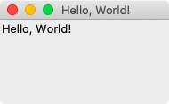
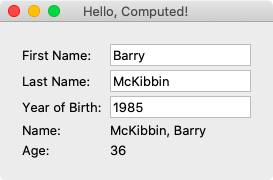

# [](https://github.com/AndyObtiva/glimmer) Glimmer DSL for Tk 0.0.15
## MRI Ruby Desktop Development GUI Library
[](http://badge.fury.io/rb/glimmer-dsl-tk)
[](https://coveralls.io/github/AndyObtiva/glimmer-dsl-tk?branch=master)
[](https://codeclimate.com/github/AndyObtiva/glimmer-dsl-tk/maintainability)
[](https://gitter.im/AndyObtiva/glimmer?utm_source=badge&utm_medium=badge&utm_campaign=pr-badge&utm_content=badge)

**[Contributors Wanted! (Submit a Glimmer App Sample to Get Started)](CONTRIBUTING.md)**

[Glimmer](https://github.com/AndyObtiva/glimmer) DSL for [Tk](https://www.tcl.tk/) enables desktop development with [Glimmer](https://github.com/AndyObtiva/glimmer) in [Ruby](https://github.com/ruby/ruby).

[Tcl/Tk](https://www.tcl.tk/) has evolved into a practical desktop GUI toolkit due to gaining native looking themed widgets on Mac, Windows, and Linux in [Tk version 8.5](https://www.tcl.tk/software/tcltk/8.5.html#:~:text=Highlights%20of%20Tk%208.5&text=Font%20rendering%3A%20Now%20uses%20anti,and%20window%20layout%2C%20and%20more.).

Additionally, [Ruby](https://www.ruby-lang.org/en/) 3.0 Ractor (formerly known as [Guilds](https://olivierlacan.com/posts/concurrency-in-ruby-3-with-guilds/)) supports truly parallel multi-threading, making both [MRI](https://github.com/ruby/ruby) and [Tk](https://www.tcl.tk/) finally viable for support in [Glimmer](https://github.com/AndyObtiva/glimmer) (Ruby Desktop Development GUI Library) as an alternative to [JRuby on SWT](https://github.com/AndyObtiva/glimmer-dsl-swt).

The trade-off is that while [SWT](https://www.eclipse.org/swt/) provides a plethora of high quality reusable widgets for the Enterprise (such as [Nebula](https://www.eclipse.org/nebula/)), [Tk](https://www.tcl.tk/) enables very fast app startup time and a small memory footprint via [MRI Ruby](https://www.ruby-lang.org/en/).

[Glimmer DSL for Tk](https://github.com/AndyObtiva/glimmer-dsl-tk) aims to provide a DSL similar to the [Glimmer DSL for SWT](https://github.com/AndyObtiva/glimmer-dsl-swt) to enable more productive desktop development in Ruby with:
- Declarative DSL syntax that visually maps to the GUI widget hierarchy
- Convention over configuration via smart defaults and automation of low-level details
- Requiring the least amount of syntax possible to build GUI
- Bidirectional Data-Binding to declaratively wire and automatically synchronize GUI with Business Models
- Custom Widget support
- Scaffolding for new custom widgets, apps, and gems
- Native-Executable packaging on Mac, Windows, and Linux

**Hello, World!**

Glimmer code (from [samples/hello/hello_world.rb](samples/hello/hello_world.rb)):

```ruby
require 'glimmer-dsl-tk'

include Glimmer

root {
  title 'Hello, World!'
  
  label {
    text 'Hello, World!'
  }
}.open
```

Run with [glimmer-dsl-tk](https://rubygems.org/gems/glimmer-dsl-tk) gem installed:

```
ruby -r glimmer-dsl-tk -e "require 'samples/hello/hello_world'"
```

Glimmer app:



NOTE: Glimmer DSL for Tk is currently in early alpha mode (incomplete). Please help make better by contributing, adopting for small or low risk projects, and providing feedback. It is still an early alpha, so the more feedback and issues you report the better.

Other [Glimmer](https://github.com/AndyObtiva/glimmer) DSL gems:
- [glimmer-dsl-swt](https://github.com/AndyObtiva/glimmer-dsl-swt): Glimmer DSL for SWT (JRuby Desktop Development GUI Framework)
- [glimmer-dsl-libui](https://github.com/AndyObtiva/glimmer-dsl-libui): Glimmer DSL for LibUI (Prerequisite-Free Ruby Desktop Development GUI Library)
- [glimmer-dsl-opal](https://github.com/AndyObtiva/glimmer-dsl-opal): Glimmer DSL for Opal (Pure Ruby Web GUI and Auto-Webifier of Desktop Apps)
- [glimmer-dsl-xml](https://github.com/AndyObtiva/glimmer-dsl-xml): Glimmer DSL for XML (& HTML)
- [glimmer-dsl-css](https://github.com/AndyObtiva/glimmer-dsl-css): Glimmer DSL for CSS (Cascading Style Sheets)

## Pre-requisites

- [Tcl/Tk](https://www.tcl.tk/): Follow the [install instructions](https://tkdocs.com/tutorial/install.html)
- [Ruby](https://www.ruby-lang.org/en/): On Windows, obtain from the Ruby [download page](https://www.ruby-lang.org/en/downloads/). On the Mac and Linux, it is more convenient to just use [RVM](http://rvm.io) and follow the [RVM Tk instructions](https://rvm.io/integration/tk).

For example, on the Mac, you can:
- Install the ActiveTcl Mac package from [ActiveState.com](https://activestate.com)
- Install [RVM](https://rvm.io/) by running `\curl -sSL https://get.rvm.io | bash -s stable` (and run `curl -sSL https://rvm.io/pkuczynski.asc | gpg --import -` if needed for mentioned security reasons)
- Run: `rvm install 2.7.1 --enable-shared --enable-pthread --with-tk --with-tcl`
- Run: `gem install tk -v0.4.0`

Afterwards, if you open `irb`, you should be able to run `require 'tk'` successfully.

## Setup

### Option 1: Install

Run this command to install directly:
```
gem install glimmer-dsl-tk
```

### Option 2: Bundler

Add the following to `Gemfile`:
```
gem 'glimmer-dsl-tk', '~> 0.0.15'
```

And, then run:
```
bundle
```

## Girb (Glimmer IRB)

You can run the `girb` command (`bin/girb` if you cloned the project locally):

```
girb
```

This gives you `irb` with the `glimmer-dsl-tk` gem loaded and the `Glimmer` module mixed into the main object for easy experimentation with GUI.

## Tk Concepts

Here is a summary taken from the official [Tk Concepts Tutorial](https://tkdocs.com/tutorial/concepts.html)

Tk Concepts consist of:
- [Widgets](https://tkdocs.com/tutorial/concepts.html#widgets): Widgets are all the things that you see onscreen. In our example, we had a button, an entry, a few labels, and a frame. Others are things like checkboxes, tree views, scrollbars, text areas, and so on. Widgets are what are often referred to as "controls"; you'll also often see them referred to as "windows," particularly in Tk's documentation, a holdover from its X11 roots (so under that terminology, both a toplevel window and things like a button would be called windows).
- [Geometry Management](https://tkdocs.com/tutorial/concepts.html#geometry): If you've been playing around creating widgets, you've probably noticed that just by creating them, they didn't end up showing up onscreen. Having things actually put in the onscreen window, and precisely where in the window they show up is a separate step called geometry management.
- [Event Handling](https://tkdocs.com/tutorial/concepts.html#events): In Tk, as in most other user interface toolkits, there is an event loop which receives events from the operating system. These are things like button presses, keystrokes, mouse movement, window resizing, and so on.

Learn more at the official [Tk Concepts Tutorial](https://tkdocs.com/tutorial/concepts.html)

## Glimmer GUI DSL Concepts

The Glimmer GUI DSL provides a declarative syntax for [Tk](https://www.tcl.tk/) that:
- Supports smart defaults (e.g. grid layout on most widgets)
- Automates wiring of widgets (e.g. nesting a label under a toplevel root or adding a frame to a notebook)
- Hides lower-level details (e.g. main loop is started automatically when opening a window)
- Nests widgets according to their visual hierarchy
- Requires the minimum amount of syntax needed to describe an app's GUI

The Glimmer GUI DSL follows these simple concepts in mapping from Tk syntax:
- **Widget Keyword**: Any Tk widget (e.g. `Tk::Tile::Label`) or toplevel window (e.g. `TkRoot`) may be declared by its lower-case underscored name without the namespace (e.g. `label` or `root`). This is called a keyword and is represented in the Glimmer GUI DSL by a Ruby method behind the scenes.
- **Args**: Any keyword method may optionally take arguments surrounded by parentheses (e.g. a `frame` nested under a `notebook` may receive tab options like `frame(text: 'Users')`, which gets used behind the scenes by Tk code such as `notebook.add tab, text: 'Users'`)
- **Content/Options Block**: Any keyword may optionally be followed by a Ruby curly-brace block containing nested widgets (content) and attributes (options). Attributes are simply Tk option keywords followed by arguments and no block (e.g. `title 'Hello, World!'` under a `root`)

Example of an app written in [Tk](https://www.tcl.tk/) imperative syntax:

```ruby
root = TkRoot.new
root.title = 'Hello, Tab!'

notebook = ::Tk::Tile::Notebook.new(root).grid

tab1 = ::Tk::Tile::Frame.new(notebook).grid
notebook.add tab1, text: 'English'
label1 = ::Tk::Tile::Label.new(tab1).grid
label1.text = 'Hello, World!'

tab2 = ::Tk::Tile::Frame.new(notebook).grid
notebook.add tab2, text: 'French'
label2 = ::Tk::Tile::Label.new(tab2).grid
label2.text = 'Bonjour, Univers!'

root.mainloop
```

Example of the same app written in [Glimmer](https://github.com/AndyObtiva/glimmer) declarative syntax:

```ruby
root {
  title 'Hello, Tab!'
   
  notebook {
    frame(text: 'English') {
      label {
        text 'Hello, World!'
      }
    }
     
    frame(text: 'French') {
      label {
        text 'Bonjour, Univers!'
      }
    }
  }
}.open
```

### Supported Widgets

keyword(args) | attributes | listeners / events / bindings / callbacks
------------- | ---------- | ---------
`button` | `text`, `image`, `compound` (`'center', 'top', 'bottom', 'left', 'right'`), `default` (`'active', 'normal'`) | `command`
`entry` | `width`, `text` | None
`frame(text: )` | None | None
`label` | `text` | None
`list` | `selectmode`, `selection` | None
`message_box(type: , message: , detail: , title: , icon: , default: , parent: )` | None | None
`notebook` | None | None
`root` | `title`, `iconphoto` | None

#### Common Attributes

- `grid`

### Smart Defaults and Convensions

#### Grid Layout

`grid` layout is the default on most widgets (which support it).

#### Icon Photo

The `iconphoto` attribute on `root` is set to the Glimmer icon by default if no icon photo is supplied.

Otherwise, [Glimmer DSL for Tk](https://rubygems.org/gems/glimmer-dsl-tk) is smart enough to accept an image path directly (no need to wrap with `TkPhotoImage`)

Example with direct image path (you may copy/paste in [`girb`](#girb-glimmer-irb)):

```ruby
root {
  title 'Title'
  iconphoto 'icons/glimmer.png'
}.open
```

Example with `TkPhotoImage` object (you may copy/paste in [`girb`](#girb-glimmer-irb)):

```ruby
root {
  title 'Title'
  iconphoto TkPhotoImage.new(file: 'icons/glimmer.png')
}.open
```

## The Grid Geometry Manager

The Grid Geometry Manager is supported via the `grid` keyword just as per the [Tk documentation](https://tkdocs.com/tutorial/grid.html), except by nesting under the widget it concerns.

Example:

```ruby
        label {
          grid column: 0, row: 2, sticky: 'w'
          text 'Year of Birth: '
        }
        entry {
          grid column: 1, row: 2
          width 15
          text <=> [@contact, :year_of_birth]
        }
```

More details can be found in the [Hello, Computed!](#hello-computed) sample below.

## Bidirectional Data-Binding

Glimmer supports Shine syntax bidirectional data-binding via the `<=>` operator (read-write) and unidirectional data-binding via the `<=` operator (read-only), which takes a model and an attribute (the `bind` keyword may also be used as the old-style of data-binding).

### General Property Data-Binding

Example:

This assumes a `Person` model with a `country` attribute.

```ruby
  label {
    text <=> [person, :country]
  }
```

That code binds the `textvariable` value of the `label` to the `country` property on the `person` model.

It automatically handles all the Tk plumbing behind the scenes.

More details can be found in the [Hello, Computed!](#hello-computed) sample below.

### Combobox Data-Binding

Example:

This assumes a `Person` model with a `country` attribute representing their current country and a `country_options` attribute representing available options for the country attribute.

```ruby
  combobox {
    state 'readonly'
    text <=> [person, :country]
  }
```

That code sets the `values` of the `combobox` to the `country_options` property on the `person` model (data-binding attribute + "_options" by convention).
It also binds the `text` selection of the `combobox` to the `country` property on the `person` model.

It automatically handles all the Tk plumbing behind the scenes, such as using `TkVariable` and setting `combobox` `values` from `person.country_options` by convention (attribute_name + "_options").

More details can be found in the [Hello, Combobox!](#hello-combobox) sample below.

### List Single Selection Data-Binding

Tk does not support a native themed listbox, so Glimmer implements its own `list` widget on top of `Tk::Tile::Treeview`. It is set to single selection via selectmode 'browse'.

Example:

This assumes a `Person` model with a `country` attribute representing their current country and a `country_options` attribute representing available options for the country attribute.

```ruby
  list {
    selectmode 'browse'
    text <=> [person, :country]
  }
```

That code binds the `items` text of the `list` to the `country_options` property on the `person` model (data-binding attribute + "_options" by convention).
It also binds the `selection` text of the `list` to the `country` property on the `person` model.

It automatically handles all the Tk plumbing behind the scenes.

More details can be found in the [Hello, List Single Selection!](#hello-list-single-selection) sample below.

### List Multi Selection Data-Binding

Tk does not support a native themed listbox, so Glimmer implements its own `list` widget on top of `Tk::Tile::Treeview`. It is set to multi selection by default.

Example:

This assumes a `Person` model with a `provinces` attribute representing their current country and a `provinces_options` attribute representing available options for the provinces attribute.

```ruby
  list {
    text <=> [person, :provinces]
  }
```

That code binds the `items` text of the `list` to the `provinces_options` property on the `person` model (data-binding attribute + "_options" by convention).
It also binds the `selection` text of the `list` to the `provinces` property on the `person` model.

It automatically handles all the Tk plumbing behind the scenes.

More details can be found in the [Hello, List Multi Selection!](#hello-list-multi-selection) sample below.

### Entry Data-Binding

Example:

This assumes a `Person` model with a `country` attribute.

```ruby
  entry {
    text <=> [person, :country]
  }
```

That code binds the `textvariable` value of the `entry` to the `country` property on the `person` model.

It automatically handles all the Tk plumbing behind the scenes.

More details can be found in the [Hello, Computed!](#hello-computed) sample below.

## Command Observer

Buttons can set a `command` option to trigger when the user clicks the button. This may be done with the `command` keyword, passing in a block directly (no need for `proc` as per Tk)

Example:

```ruby
  button {
    text "Reset Selection"
    command {
      person.reset_country
    }
  }
```

This resets the person country.

More details can be found in the [Hello, Combobox!](#hello-combobox) sample below.

## Samples

### Hello, World!

Glimmer code (from [samples/hello/hello_world.rb](samples/hello/hello_world.rb)):

```ruby
require 'glimmer-dsl-tk'

include Glimmer

root {
  title 'Hello, World!'
  
  label {
    text 'Hello, World!'
  }
}.open
```

Run with [glimmer-dsl-tk](https://rubygems.org/gems/glimmer-dsl-tk) gem installed:

```
ruby -r glimmer-dsl-tk -e "require 'samples/hello/hello_world'"
```

Alternatively, run from cloned project without [glimmer-dsl-tk](https://rubygems.org/gems/glimmer-dsl-tk) gem installed:

```
ruby -r ./lib/glimmer-dsl-tk.rb ./samples/hello/hello_world.rb
```

Glimmer app:


### Hello, Button!

Glimmer code (from [samples/hello/hello_button.rb](samples/hello/hello_button.rb)):

```ruby
require 'glimmer-dsl-tk'

class HelloButton
  include Glimmer
  
  attr_accessor :count
  
  def initialize
    @count = 0
  end
  
  def launch
    root {
      title 'Hello, Button!'
      
      frame {
        grid row: 0, column: 0
        
        label {
          grid pady: 15
          text 'Text Button'
        }
        
        button {
          text <= [self, :count, on_read: ->(value) { "Click To Increment: #{value}  " }]
          default 'active'
          
          command {
            self.count += 1
          }
        }
      }
        
      frame {
        grid row: 0, column: 1
        
        label {
          grid pady: 15
          text 'Image Button'
        }
        
        button {
          image File.expand_path('../../icons/glimmer.png', __dir__), subsample: 5
          
          command {
            message_box(title: 'Image Button', message: 'Image Button Clicked!')
          }
        }
      }
      
      frame {
        grid row: 0, column: 2
        
        label {
          grid pady: 15
          text 'Text Image Buttons'
        }
        
        ['center', 'top', 'bottom', 'left', 'right'].each do |compound_option|
          button {
            image File.expand_path('../../icons/glimmer.png', __dir__), subsample: 5
            text 'Text Image Button'
            compound compound_option
            
            command {
              message_box(title: 'Text Image Button', message: 'Text Image Button Clicked!', detail: "(#{compound_option})")
            }
          }
        end
      }
    }.open
  end
end

HelloButton.new.launch
```

Run with [glimmer-dsl-tk](https://rubygems.org/gems/glimmer-dsl-tk) gem installed:

```
ruby -r glimmer-dsl-tk -e "require 'samples/hello/hello_button'"
```

Alternatively, run from cloned project without [glimmer-dsl-tk](https://rubygems.org/gems/glimmer-dsl-tk) gem installed:

```
ruby -r ./lib/glimmer-dsl-tk.rb ./samples/hello/hello_button.rb
```

Glimmer app:


### Hello, Tab!

Glimmer code (from [samples/hello/hello_tab.rb](samples/hello/hello_tab.rb)):

```ruby
include Glimmer

root {
  title 'Hello, Tab!'
   
  notebook {
    frame(text: 'English') {
      label {
        text 'Hello, World!'
      }
    }
     
    frame(text: 'French') {
      label {
        text 'Bonjour, Univers!'
      }
    }
  }
}.open
```

Run with [glimmer-dsl-tk](https://rubygems.org/gems/glimmer-dsl-tk) gem installed:

```
ruby -r glimmer-dsl-tk -e "require 'samples/hello/hello_tab'"
```

Alternatively, run from cloned project without [glimmer-dsl-tk](https://rubygems.org/gems/glimmer-dsl-tk) gem installed:

```
ruby -e "require './lib/glimmer-dsl-tk'; require './samples/hello/hello_tab'"
```

Glimmer app:


### Hello, Message Box!

Glimmer code (from [samples/hello/hello_message_box.rb](samples/hello/hello_message_box.rb)):

```ruby
root { |r|
  title 'Hello, Message Box!'
  
  frame {
    grid sticky: 'nsew', padx: 15, pady: 15
    
    button {
      text 'Please Click To Win a Surprise'
      
      command {
        # specifying parent ensures dialog shows up centered on top of window (instead of centered in display monitor)
        @result_label.text = message_box(parent: r, title: 'Surprise', message: "Congratulations!\n\nYou won $1,000,000!") # type: 'ok' by default
      }
    }
    
    button {
      text 'Download Software Update'
      
      command {
        @result_label.text = message_box(type: 'okcancel', title: 'Software Update', message: "We will begin to download software update.")
      }
    }
    
    button {
      text 'Format Hard Drive'
      
      command {
        @result_label.text = message_box(type: 'yesno', icon: 'question', title: 'Format', message: "Would you like to format your hard drive?")
      }
    }
    
    button {
      text 'Submit Application'
      
      command {
        @result_label.text = message_box(type: 'yesnocancel', icon: 'question', title: 'Application', message: "Would you like to review application before submitting?")
      }
    }
    
    button {
      text 'Play Video'
      
      command {
        @result_label.text = message_box(type: 'retrycancel', icon: 'error', title: 'Video Replay', message: "Video has failed to play. Would you like to retry?")
      }
    }
    
    button {
      text 'Installation Completed'
      
      command {
        @result_label.text = message_box(type: 'abortretryignore', icon: 'warning', default: 'ignore', title: 'Failed To Install Extra Utilities', message: "Installation is complete, but extra utilities have failed to install. Would you like to retry installing extra utilities?", detail: 'Encountered network error in downloading extra utilities, resulting in failure to install them')
      }
    }
  }
  
  frame {
    grid sticky: 'nsew', padx: 15, pady: 15
    
    label {
      grid row: 0, column: 0
      text 'Result:'
    }
    
    @result_label = label {
      grid row: 0, column: 1
    }
  }
}.open
```

Run with [glimmer-dsl-tk](https://rubygems.org/gems/glimmer-dsl-tk) gem installed:

```
ruby -r glimmer-dsl-tk -e "require 'samples/hello/hello_tab'"
```

Alternatively, run from cloned project without [glimmer-dsl-tk](https://rubygems.org/gems/glimmer-dsl-tk) gem installed:

```
ruby -e "require './lib/glimmer-dsl-tk'; require './samples/hello/hello_tab'"
```

Glimmer app:


### Hello, Combobox!

Glimmer code (from [samples/hello/hello_combobox.rb](samples/hello/hello_combobox.rb)):

```ruby
# ... more code precedes
root {
  title 'Hello, Combobox!'
  
  combobox { |proxy|
    state 'readonly'
    text <=> [person, :country]
  }
  
  button { |proxy|
    text "Reset Selection"
    command {
      person.reset_country
    }
  }
}.open
# ... more code follows
```

Run with [glimmer-dsl-tk](https://rubygems.org/gems/glimmer-dsl-tk) gem installed:

```
ruby -r glimmer-dsl-tk -e "require 'samples/hello/hello_combobox'"
```

Alternatively, run from cloned project without [glimmer-dsl-tk](https://rubygems.org/gems/glimmer-dsl-tk) gem installed:

```
ruby -e "require './lib/glimmer-dsl-tk'; require './samples/hello/hello_combobox'"
```

Glimmer app:


### Hello, List Single Selection!

Glimmer code (from [samples/hello/hello_list_single_selection.rb](samples/hello/hello_list_single_selection.rb)):

```ruby
# ... more code precedes
root {
  title 'Hello, List Single Selection!'
  
  list {
    selectmode 'browse'
    selection <=> [person, :country]
  }
  
  button {
    text "Reset Selection To Default Value"
    
    command { person.reset_country }
  }
}.open
# ... more code follows
```

Run with [glimmer-dsl-tk](https://rubygems.org/gems/glimmer-dsl-tk) gem installed:

```
ruby -r glimmer-dsl-tk -e "require 'samples/hello/hello_list_single_selection'"
```

Alternatively, run from cloned project without [glimmer-dsl-tk](https://rubygems.org/gems/glimmer-dsl-tk) gem installed:

```
ruby -e "require './lib/glimmer-dsl-tk'; require './samples/hello/hello_list_single_selection'"
```

Glimmer app:


### Hello, List Multi Selection!

Glimmer code (from [samples/hello/hello_list_multi_selection.rb](samples/hello/hello_list_multi_selection.rb)):

```ruby
# ... more code precedes
root {
  title 'Hello, List Multi Selection!'
  
  list {
    selection <=> [person, :provinces]
  }
  
  button {
    text "Reset Selection To Defaults"
    
    command { person.reset_provinces }
  }
}.open
# ... more code follows
```

Run with [glimmer-dsl-tk](https://rubygems.org/gems/glimmer-dsl-tk) gem installed:

```
ruby -r glimmer-dsl-tk -e "require 'samples/hello/hello_list_multi_selection'"
```

Alternatively, run from cloned project without [glimmer-dsl-tk](https://rubygems.org/gems/glimmer-dsl-tk) gem installed:

```
ruby -e "require './lib/glimmer-dsl-tk'; require './samples/hello/hello_list_multi_selection'"
```

Glimmer app:


### Hello, Computed!

Glimmer code (from [samples/hello/hello_computed.rb](samples/hello/hello_computed.rb)):

```ruby
# ... more code precedes
    root {
      title 'Hello, Computed!'
      
      frame {
        grid column: 0, row: 0, padx: 5, pady: 5
        
        label {
          grid column: 0, row: 0, sticky: 'w'
          text 'First Name: '
        }
        entry {
          grid column: 1, row: 0
          width 15
          text <=> [@contact, :first_name]
        }
        
        label {
          grid column: 0, row: 1, sticky: 'w'
          text 'Last Name: '
        }
        entry {
          grid column: 1, row: 1
          width 15
          text <=> [@contact, :last_name]
        }
        
        label {
          grid column: 0, row: 2, sticky: 'w'
          text 'Year of Birth: '
        }
        entry {
          grid column: 1, row: 2
          width 15
          text <=> [@contact, :year_of_birth]
        }
        
        label {
          grid column: 0, row: 3, sticky: 'w'
          text 'Name: '
        }
        label {
          grid column: 1, row: 3, sticky: 'w'
          text <=> [@contact, :name, computed_by: [:first_name, :last_name]]
        }
        
        label {
          grid column: 0, row: 4, sticky: 'w'
          text 'Age: '
        }
        label {
          grid column: 1, row: 4, sticky: 'w'
          text <=> [@contact, :age, on_write: :to_i, computed_by: [:year_of_birth]]
        }
      }
    }.open
# ... more code follows
```

Run with [glimmer-dsl-tk](https://rubygems.org/gems/glimmer-dsl-tk) gem installed:

```
ruby -r glimmer-dsl-tk -e "require 'samples/hello/hello_computed'"
```

Alternatively, run from cloned project without [glimmer-dsl-tk](https://rubygems.org/gems/glimmer-dsl-tk) gem installed:

```
ruby -e "require './lib/glimmer-dsl-tk'; require './samples/hello/hello_computed'"
```

Glimmer app:



## Help

### Issues

You may submit [issues](https://github.com/AndyObtiva/glimmer/issues) on [GitHub](https://github.com/AndyObtiva/glimmer/issues).

[Click here to submit an issue.](https://github.com/AndyObtiva/glimmer/issues)

### Chat

If you need live help, try to [](https://gitter.im/AndyObtiva/glimmer?utm_source=badge&utm_medium=badge&utm_campaign=pr-badge&utm_content=badge)

## Process

[Glimmer Process](https://github.com/AndyObtiva/glimmer/blob/master/PROCESS.md)

## Planned Features and Feature Suggestions

These features have been planned or suggested. You might see them in a future version of [Glimmer DSL for Tk](https://rubygems.org/gems/glimmer-dsl-tk). You are welcome to contribute more feature suggestions.

[TODO.md](TODO.md)

## Change Log

[CHANGELOG.md](CHANGELOG.md)

## Contributing

[CONTRIBUTING.md](CONTRIBUTING.md)

## Contributors

* [Andy Maleh](https://github.com/AndyObtiva) (Founder)

[Click here to view contributor commits.](https://github.com/AndyObtiva/glimmer-dsl-tk/graphs/contributors)

## License

[MIT](LICENSE.txt)

Copyright (c) 2020-2021 - Andy Maleh.

--

[](https://github.com/AndyObtiva/glimmer) Built for [Glimmer](https://github.com/AndyObtiva/glimmer) (DSL Framework).
