# [](https://github.com/AndyObtiva/glimmer) Glimmer DSL for Tk 0.0.52
## MRI Ruby Desktop Development GUI Library
[](http://badge.fury.io/rb/glimmer-dsl-tk)
[](https://github.com/AndyObtiva/glimmer-dsl-tk/actions/workflows/ruby.yml)
[](https://coveralls.io/github/AndyObtiva/glimmer-dsl-tk?branch=master)
[](https://codeclimate.com/github/AndyObtiva/glimmer-dsl-tk/maintainability)
[](https://gitter.im/AndyObtiva/glimmer?utm_source=badge&utm_medium=badge&utm_campaign=pr-badge&utm_content=badge)

**[Contributors Wanted! (Submit a Glimmer App Sample to Get Started)](CONTRIBUTING.md)**

[Glimmer](https://github.com/AndyObtiva/glimmer) DSL for [Tk](https://www.tcl.tk/) enables desktop development with [Glimmer](https://github.com/AndyObtiva/glimmer) in [Ruby](https://github.com/ruby/ruby).

[Tcl/Tk](https://www.tcl.tk/) has recently improved by gaining native looking themed widgets on Mac, Windows, and Linux in [Tk version 8.5](https://www.tcl.tk/software/tcltk/8.5.html#:~:text=Highlights%20of%20Tk%208.5&text=Font%20rendering%3A%20Now%20uses%20anti,and%20window%20layout%2C%20and%20more.). Additionally, [Ruby](https://www.ruby-lang.org/en/) 3.0 Ractor (formerly known as [Guilds](https://olivierlacan.com/posts/concurrency-in-ruby-3-with-guilds/)) supports truly parallel multi-threading, making both [MRI](https://github.com/ruby/ruby) and [Tk](https://www.tcl.tk/) finally viable for support in [Glimmer](https://github.com/AndyObtiva/glimmer) (Ruby Desktop Development GUI Library) as an alternative to [JRuby on SWT](https://github.com/AndyObtiva/glimmer-dsl-swt).

The trade-off is that while [SWT](https://www.eclipse.org/swt/) provides a plethora of high quality reusable widgets for the Enterprise (such as [Nebula](https://github.com/AndyObtiva/glimmer-cw-nebula)), [Tk](https://www.tcl.tk/) has a very fast app startup time and a small memory footprint courtesy of [MRI Ruby](https://www.ruby-lang.org/en/).

[Glimmer DSL for Tk](https://github.com/AndyObtiva/glimmer-dsl-tk) aims to provide a DSL similar to the [Glimmer DSL for SWT](https://github.com/AndyObtiva/glimmer-dsl-swt) to enable more productive desktop development in Ruby with:
- Declarative DSL syntax that visually maps to the GUI widget hierarchy
- Convention over configuration via smart defaults and automation of low-level details
- Requiring the least amount of syntax possible to build GUI
- Bidirectional Data-Binding to declaratively wire and automatically synchronize GUI with Business Models
- (Future Plan) Custom Widget support
- (Future Plan) Scaffolding for new custom widgets, apps, and gems
- (Future Plan) Native-Executable packaging on Mac, Windows, and Linux

**Hello, World!**

Glimmer code (from [samples/hello/hello_world.rb](samples/hello/hello_world.rb)):

```ruby
require 'glimmer-dsl-tk'

include Glimmer

root {
  title 'Hello, World!'
  
  label {
    text 'Hello, World!'
  }
}.open
```

Run with [glimmer-dsl-tk](https://rubygems.org/gems/glimmer-dsl-tk) gem installed:

```
ruby -r glimmer-dsl-tk -e "require 'samples/hello/hello_world'"
```

Glimmer app:


NOTE: Glimmer DSL for Tk is currently in early alpha mode (only about 44% complete). If you want it developed faster, then [open an issue report](https://github.com/AndyObtiva/glimmer-dsl-tk/issues/new). I have completed some features much faster before due to [issue reports](https://github.com/AndyObtiva/glimmer-dsl-tk/issues) and [pull requests](https://github.com/AndyObtiva/glimmer-dsl-tk/pulls). Please help make better by contributing, adopting for small or low risk projects, and providing feedback. It is still an early alpha, so the more feedback and issues you report the better.

Other [Glimmer](https://github.com/AndyObtiva/glimmer) DSL gems you might be interested in:
- [glimmer-dsl-swt](https://github.com/AndyObtiva/glimmer-dsl-swt): Glimmer DSL for SWT (JRuby Desktop Development GUI Framework)
- [glimmer-dsl-opal](https://github.com/AndyObtiva/glimmer-dsl-opal): Glimmer DSL for Opal (Pure Ruby Web GUI and Auto-Webifier of Desktop Apps)
- [glimmer-dsl-libui](https://github.com/AndyObtiva/glimmer-dsl-libui): Glimmer DSL for LibUI (Prerequisite-Free Ruby Desktop Development GUI Library)
- [glimmer-dsl-gtk](https://github.com/AndyObtiva/glimmer-dsl-gtk): Glimmer DSL for GTK (Ruby-GNOME Desktop Development GUI Library)
- [glimmer-dsl-xml](https://github.com/AndyObtiva/glimmer-dsl-xml): Glimmer DSL for XML (& HTML)
- [glimmer-dsl-css](https://github.com/AndyObtiva/glimmer-dsl-css): Glimmer DSL for CSS (Cascading Style Sheets)

## Table of Contents

- [Glimmer DSL for Tk](#)
  - [MRI Ruby Desktop Development GUI Library](#mri-ruby-desktop-development-gui-library)
  - [Pre-requisites](#pre-requisites)
  - [Setup](#setup)
    - [Option 1: Install](#option-1-install)
    - [Option 2: Bundler](#option-2-bundler)
  - [Girb (Glimmer IRB)](#girb-glimmer-irb)
  - [Tk Concepts](#tk-concepts)
  - [Glimmer GUI DSL Concepts](#glimmer-gui-dsl-concepts)
    - [Supported Widgets](#supported-widgets)
      - [Common Attributes](#common-attributes)
      - [Common Themed Widget States](#common-themed-widget-states)
      - [Text API](#text-api)
      - [Drag and Drop API](#drag-and-drop-api)
    - [Smart Defaults and Conventions](#smart-defaults-and-conventions)
      - [Grid Layout](#grid-layout)
      - [Image Attribute](#image-attribute)
      - [Frame Padding](#frame-padding)
      - [Notebook Frame](#notebook-frame)
      - [Menu Item Accelerator](#menu-item-accelerator)
      - [Icon Photo](#icon-photo)
      - [Root Background](#root-background)
      - [Toplevel Mac Style](#toplevel-mac-style)
      - [Root/Toplevel Centered Within Screen](#root-toplevel-centered-within-screen)
      - [Text Defaults](#text-defaults)
  - [The Grid Geometry Manager](#the-grid-geometry-manager)
  - [Data-Binding](#data-binding)
    - [Label Data-Binding](#label-data-binding)
    - [Combobox Data-Binding](#combobox-data-binding)
    - [List Single Selection Data-Binding](#list-single-selection-data-binding)
    - [List Multi Selection Data-Binding](#list-multi-selection-data-binding)
    - [Entry Data-Binding](#entry-data-binding)
    - [Text Data-Binding](#text-data-binding)
    - [Spinbox Data-Binding](#spinbox-data-binding)
    - [Checkbutton Data-Binding](#checkbutton-data-binding)
    - [Radiobutton Data-Binding](#radiobutton-data-binding)
  - [Command Callback](#command-callback)
  - [Gotchas](#gotchas)
  - [Glimmer Style Guide](#glimmer-style-guide)
  - [Samples](#samples)
    - [Hello, World!](#hello-world)
    - [Hello, Button!](#hello-button)
    - [Hello, Checkbutton!](#hello-checkbutton)
    - [Hello, Radiobutton!](#hello-radiobutton)
    - [Hello, Frame!](#hello-frame)
    - [Hello, Root!](#hello-root)
    - [Hello, Toplevel!](#hello-toplevel)
    - [Hello, Notebook!](#hello-notebook)
    - [Hello, Label!](#hello-label)
    - [Hello, Message Box!](#hello-message-box)
    - [Hello, Combobox!](#hello-combobox)
    - [Hello, List Single Selection!](#hello-list-single-selection)
    - [Hello, List Multi Selection!](#hello-list-multi-selection)
    - [Hello, Entry!](#hello-entry)
    - [Hello, Text!](#hello-text)
    - [Hello, Spinbox!](#hello-spinbox)
    - [Hello, Computed!](#hello-computed)
    - [Hello, Drag and Drop!](#hello-drag-and-drop)
    - [Hello, Built-in Dialog!](#hello-built-in-dialog)
    - [Hello, Separator!](#hello-separator)
    - [Hello, Scrollbar!](#hello-scrollbar)
    - [Hello, Scrollbar Frame!](#hello-scrollbar-frame)
    - [Hello, Menu Bar!](#hello-menu-bar)
    - [Hello, Contextual Menu!](#hello-contextual-menu)
  - [Applications](#applications)
    - [Glimmer Tk Calculator](#glimmer-tk-calculator)
    - [Y3network Ruby UI](#y3network-ruby-ui)
    - [CryptoPunks GUI](#cryptopunks-gui)
    - [Circule](#circule)
  - [Process](#process)
  - [Resources](#resources)
  - [Help](#help)
    - [Issues](#issues)
    - [Chat](#chat)
  - [Planned Features and Feature Suggestions](#planned-features-and-feature-suggestions)
  - [Change Log](#change-log)
  - [Contributing](#contributing)
  - [Contributors](#contributors)
  - [License](#license)

## Pre-requisites

- [Tcl/Tk 8.6](https://www.tcl.tk/): Follow the exact instructions below (if a further reference is needed, here are the [official install instructions](https://tkdocs.com/tutorial/install.html))
- [Ruby](https://www.ruby-lang.org/en/): On Windows, obtain from the Ruby [download page](https://www.ruby-lang.org/en/downloads/). On the Mac and Linux, it is more convenient to just use [RVM](http://rvm.io) and follow the [RVM Tk instructions](https://rvm.io/integration/tk).

**Mac:**
- Install the ActiveTcl 8.6 Mac package from [ActiveState.com](https://activestate.com)
- Install [RVM](https://rvm.io/) by running `\curl -sSL https://get.rvm.io | bash -s stable` (and run `curl -sSL https://rvm.io/pkuczynski.asc | gpg --import -` if needed for mentioned security reasons)
- Run: `rvm install 3.0.2 --enable-shared --enable-pthread --with-tk --with-tcl`
- Run: `gem install tk -v0.4.0`

**Windows:**
- Install Ruby+Devkit (including MSYS/MINGW toolchains) through Windows Installer: https://rubyinstaller.org/downloads/
- Install the ActiveTcl 8.6 Windows package from [ActiveState.com](https://activestate.com)
- Follow this instruction: "First, Ruby needs to find the tcl86t.dll and tk86t.dll shared libraries. These are located in C:\ActiveTcl\bin. Make a copy of them somewhere Ruby can find them, e.g. C:\Ruby26\bin."
- Setup environment variables TCL_LIBRARY=C:\ActiveTcl\lib\tcl8.6 & TK_LIBRARY=C:\ActiveTcl\lib\tk8.6
- Run: `gem install tk -v0.4.0`

**Linux:**
- Download the ActiveTcl 8.6 Linux package from [ActiveState.com](https://activestate.com)
- Extract the tar gz file using command `tar zxvf ActiveTcl-version-number.tar.gz`
- Run included install shell script `./ActiveTcl-version-number/install.sh`
- Install [RVM](https://rvm.io/) by running `\curl -sSL https://get.rvm.io | bash -s stable` (and run `curl -sSL https://rvm.io/pkuczynski.asc | gpg --import -` if needed for mentioned security reasons)
- Run: `rvm install 3.0.2 --enable-shared --enable-pthread --with-tk --with-tcl`
- Run: `gem install tk -v0.4.0`

Afterwards, if you open `irb`, you should be able to run `require 'tk'` successfully.

## Setup

Assuming you have all [Pre-Requisites](#pre-requisites) ready, follow these instructions to setup the [Ruby gem](https://rubygems.org/gems/glimmer-dsl-tk).

### Option 1: Install

Run this command to install directly:
```
gem install glimmer-dsl-tk
```

### Option 2: Bundler

Add the following to `Gemfile`:
```
gem 'glimmer-dsl-tk', '0.0.52'
```

And, then run:
```
bundle
```

## Girb (Glimmer IRB)

You can run the `girb` command (`bin/girb` if you cloned the project locally):

```
girb
```

This gives you `irb` with the `glimmer-dsl-tk` gem loaded and the `Glimmer` module mixed into the main object for easy experimentation with GUI.

## Tk Concepts

Here is a summary taken from the official [Tk Concepts Tutorial](https://tkdocs.com/tutorial/concepts.html)

Tk Concepts consist of:
- [Widgets](https://tkdocs.com/tutorial/concepts.html#widgets): Widgets are all the things that you see onscreen. In our example, we had a button, an entry, a few labels, and a frame. Others are things like checkboxes, tree views, scrollbars, text areas, and so on. Widgets are what are often referred to as "controls"; you'll also often see them referred to as "windows," particularly in Tk's documentation, a holdover from its X11 roots (so under that terminology, both a toplevel window and things like a button would be called windows).
- [Geometry Management](https://tkdocs.com/tutorial/concepts.html#geometry): If you've been playing around creating widgets, you've probably noticed that just by creating them, they didn't end up showing up onscreen. Having things actually put in the onscreen window, and precisely where in the window they show up is a separate step called geometry management.
- [Event Handling](https://tkdocs.com/tutorial/concepts.html#events): In Tk, as in most other user interface toolkits, there is an event loop which receives events from the operating system. These are things like button presses, keystrokes, mouse movement, window resizing, and so on.
- [Themes](https://tkdocs.com/tutorial/styles.html): Tk apps are themable. You can list available themes with `::Tk::Tile::Style.theme_names` (e.g. `["aqua", "clam", "alt", "default", "classic"]` on Mac) and select a theme with `::Tk::Tile::Style.theme_use 'theme_name'` (e.g. `::Tk::Tile::Style.theme_use 'classic'`). Theme defaults to `'clam'` in Linux and `'aqua'` in Mac.

Learn more at the official [Tk Concepts Tutorial](https://tkdocs.com/tutorial/concepts.html)

## Glimmer GUI DSL Concepts

The Glimmer GUI DSL provides a declarative syntax for [Tk](https://www.tcl.tk/) that:
- Supports smart defaults (e.g. grid layout on most widgets)
- Automates wiring of widgets (e.g. nesting a label under a toplevel root or adding a frame to a notebook)
- Hides lower-level details (e.g. main loop is started automatically when opening a window)
- Nests widgets according to their visual hierarchy
- Requires the minimum amount of syntax needed to describe an app's GUI

The Glimmer GUI DSL follows these simple concepts in mapping from Tk syntax:
- **Widget Keyword**: Any Tk widget (e.g. `Tk::Tile::Label`) or toplevel window (e.g. `TkRoot`) may be declared by its lower-case underscored name without the namespace (e.g. `label` or `root`). This is called a keyword and is represented in the Glimmer GUI DSL by a Ruby method behind the scenes.
- **Args**: Any keyword method may optionally take arguments surrounded by parentheses (e.g. a `frame` nested under a `notebook` may receive tab options like `frame(text: 'Users')`, which gets used behind the scenes by Tk code such as `notebook.add tab, text: 'Users'`)
- **Content/Options Block**: Any keyword may optionally be followed by a Ruby curly-brace block containing nested widgets (content) and attributes (options). Attributes are simply Tk option keywords followed by arguments and no block (e.g. `title 'Hello, World!'` under a `root`)
- **Event Binding Block**: `on(event) {}` keyword receiving a Tk binding event name (e.g. `KeyPress` or `ComboboxSelected`). Surrounding event by `<>` is optional as [Glimmer DSL for Tk](https://rubygems.org/gems/glimmer-dsl-tk) can take care of that automatically.

Note that Glimmer widgets are proxy objects (wrappers) for Tk widgets. To get wrapped Tk widget from a Glimmer widget, you simply invoke `#tk` method. To get the proxy of a wrapped Tk widget, you may invoke `#proxy` method.

Example of an app written in [Tk](https://www.tcl.tk/) imperative syntax:

```ruby
root = TkRoot.new
root.title = 'Hello, Notebook!'

notebook = ::Tk::Tile::Notebook.new(root).grid

tab1 = ::Tk::Tile::Frame.new(notebook).grid
notebook.add tab1, text: 'English'
label1 = ::Tk::Tile::Label.new(tab1).grid
label1.text = 'Hello, World!'

tab2 = ::Tk::Tile::Frame.new(notebook).grid
notebook.add tab2, text: 'French'
label2 = ::Tk::Tile::Label.new(tab2).grid
label2.text = 'Bonjour, Univers!'

root.bind('KeyPress') do |event|
  case event.keysym
  when 'e', 'E'
    notebook.select(0)
  when 'f', 'F'
    notebook.select(1)
  end
end

root.mainloop
```

Example of the same app written in [Glimmer](https://github.com/AndyObtiva/glimmer) declarative syntax:

```ruby
root {
  title 'Hello, Notebook!'
   
  @notebook = notebook {
    frame(text: 'English') {
      label {
        text 'Hello, World!'
      }
    }
     
    frame(text: 'French') {
      label {
        text 'Bonjour, Univers!'
      }
    }
  }
  
  on('KeyPress') do |event|
    case event.keysym
    when 'e', 'E'
      @notebook.select(0)
    when 'f', 'F'
      @notebook.select(1)
    end
  end
}.open
```

### Supported Widgets

keyword(args) | attributes | event bindings & callbacks
------------- | ---------- | ---------
`button` | `text`, `image` (optional keyword args: `subsample`, `zoom`, `from`, `to`, `shrink`, `compositingrule`), `compound` (`'center', 'top', 'bottom', 'left', 'right'`), `default` (`'active', 'normal'`) | `command {}`
`checkbutton` | `text`, `variable` (Boolean), `image` (optional keyword args: `subsample`, `zoom`, `from`, `to`, `shrink`, `compositingrule`), `compound` (`'center', 'top', 'bottom', 'left', 'right'`), `onvalue` (default: `1`), `offvalue` (default: `0`) | `command {}`
`choose_color(options = nil)` | None | None
`choose_directory(options = nil)` | None | None
`choose_font(options = nil) {|font| ... }` | None | None
`combobox` | `state`, `text` | `'ComboboxSelected'`
`entry` | `width`, `text`, `validate`, `show` (`'none', 'focus', 'focusin', 'focusout', 'key', or 'all'`) | `'validate'`, `'invalid'`, `'change'` (alias: `'changed'`), `validatecommand {}`, `invalidcommand {}`
`get_multiple_open_file(options = nil)` | None | None
`get_open_file(options = nil)` | None | None
`get_save_file(options = nil)` | None | None
`spinbox` | `text`, `from`, `to`, `increment`, `format`, [more attributes](https://tcl.tk/man/tcl8.6/TkCmd/text.htm#M116) | `command {}`, `'increment'`, `'decrement'`
`frame(text: nil)` | `width`, `height`, `borderwidth`, `relief` (`'flat' (default), 'raised', 'sunken', 'solid', 'ridge', 'groove'`) | None
`label` | `text`, `image` (optional keyword args: `subsample`, `zoom`, `from`, `to`, `shrink`, `compositingrule`), `compound` (`'center', 'top', 'bottom', 'left', 'right'`), `font` (`'default', 'text', 'fixed', 'menu', 'heading', 'caption', 'small_caption', 'icon', 'tooltip'`), `relief` (`'flat' (default), 'raised', 'sunken', 'solid', 'ridge', 'groove'`), `justify` (`'left', 'center', 'right'`), `foreground`, `background` | None
`lbl` (non-tile-themed version of `label`) | `text`, `image` (optional keyword args: `subsample`, `zoom`, `from`, `to`, `shrink`, `compositingrule`), `compound` (`'center', 'top', 'bottom', 'left', 'right'`), `font` (`'default', 'text', 'fixed', 'menu', 'heading', 'caption', 'small_caption', 'icon', 'tooltip'`), `relief` (`'flat' (default), 'raised', 'sunken', 'solid', 'ridge', 'groove'`), `justify` (`'left', 'center', 'right'`), `foreground`, `background`, `bg`, `bitmap`, [more here](https://tcl.tk/man/tcl8.6/TkCmd/label.htm) | None
`list` | `selectmode`, `selection` | None
`message_box(type: , message: , detail: , title: , icon: , default: , parent: )` | None | None
`menu(label: nil) (label is nil if nested under root/toplevel for menu bar)` | None | None
`menu_bar` | None | None
`menu_item(style = :command, label: , underline: )` (style also can be `:radiobutton`, `:checkbutton`, `:separator`, `:about`, `:preferences`, `:quit`, `:help`) | `state`, `accelerator`, `selection` & `variable` (if `:radiobutton` or `:checkbutton`), `image`, `compound` | `command`
`notebook` | None | None
`radiobutton` | `text`, `variable` (Boolean), `image` (optional keyword args: `subsample`, `zoom`, `from`, `to`, `shrink`, `compositingrule`), `compound` (`'center', 'top', 'bottom', 'left', 'right'`), `value` (default: `text`) | `command {}`
`root` | `title`, `iconphoto`, `background`, `alpha`, `escapable`, `fullscreen?`, `topmost?`, `transparent?`, `stackorder`, `winfo_screendepth`, `winfo_screenvisual`, `winfo_screenwidth`, `winfo_screenheight`, `winfo_pixels('li')`, `winfo_screen`, `wm_maxsize`, `state` (`'normal', 'iconic', 'withdrawn', 'icon', 'zoomed'`) | `'DELETE_WINDOW'`, `'OPEN_WINDOW'`
`scrollbar` | `orient` | `command`
`scrollbar_frame` | `xscrollbar` (Boolean or scrollbar widget proxy), `yscrollbar` (Boolean or scrollbar widget proxy) | None
`separator` | `orient` (`'horizontal' (default) or 'vertical'`) | None
`toplevel` | `title`, `iconphoto`, `background`, `alpha`, `escapable`, `fullscreen?`, `topmost?`, `transparent?`, `stackorder`, `winfo_screendepth`, `winfo_screenvisual`, `winfo_screenwidth`, `winfo_screenheight`, `winfo_pixels('li')`, `winfo_screen`, `wm_maxsize`, `state` (`'normal', 'iconic', 'withdrawn', 'icon', 'zoomed'`) | `'DELETE_WINDOW'`
`text` | `value`, [many more attributes](https://tcl.tk/man/tcl8.6/TkCmd/text.htm#M116) | `'modified'`, `'selection'`, `'insert_mark_moved'` (alias: `'insert_mark_move', 'InsertMarkMove', 'InsertMarkMoved'`)
`x_scrollbar` | `orient` (`'horizontal'`) | `command`
`y_scrollbar` | `orient` (`'vertical'`) | `command`

Options for `get_open_file` and `get_multiple_open_file` include:
- `filetypes`: `Hash` of `'Group Name' => '.ext'` entries (e.g. `filetypes: {'PNG Images' => '.png'}`

#### Common Attributes

- `grid`: `Hash` of `:row`, `:column`, `:padx`, `:pady`, `:sticky` (`'e', 'w', 'n', 's'` or any combination of direction letters)

#### Common Event Bindings

- `Activate`
- `Deactivate`
- `MouseWheel`
- `KeyPress`
- `KeyRelease`
- `ButtonPress`
- `ButtonRelease`
- `Motion`
- `Configure`
- `Map`
- `Unmap`
- `Visibility`
- `Expose`
- `Destroy`
- `FocusIn`
- `FocusOut`
- `Enter`
- `Leave`
- `Property`
- `Colormap`
- `MapRequest`
- `CirculateRequest`
- `ResizeRequest`
- `ConfigureRequest`
- `Create`
- `Gravity`
- `Reparent`
- `Circulate`

#### Common Themed Widget States

- `active?`
- `disabled?`
- `focus?`
- `pressed?`
- `selected?`
- `background?`
- `readonly?`
- `alternate?`
- `invalid?`
- `hover?`

#### Text API

The `text` widget is enhanced by [Glimmer DSL for Tk](https://rubygems.org/gems/glimmer-dsl-tk) to enable simpler manipulation of text options without dealing with [tags](https://tkdocs.com/tutorial/text.html) directly. Simply specify region to mutate and option/value or font_option/value, and [Glimmer DSL for Tk](https://rubygems.org/gems/glimmer-dsl-tk) takes care of the rest by automating work of adding/removing [tags](https://tkdocs.com/tutorial/text.html) behind the scenes.

- `add_format(region_start, region_end, option, value)`
- `remove_format(region_start, region_end, option, value)`
- `toggle_format(region_start, region_end, option, value)`
- `add_font_format(region_start, region_end, font_option, value)`
- `remove_font_format(region_start, region_end, font_option, value)`
- `toggle_font_format(region_start, region_end, font_option, value)`
- `add_selection_format(option, value, no_selection_default: :insert_word, focus: true)`: adds format to selection. If there is no selection, then applies format to current insert mark word.
- `remove_selection_format(option, value, no_selection_default: :insert_word, focus: true)`
- `toggle_selection_format(option, value, no_selection_default: :insert_word, focus: true)`: toggles format on selection. If there is no selection, then toggles format on current insert mark word.
- `add_selection_font_format(font_option, value, no_selection_default: :insert_word, focus: true)`
- `remove_selection_font_format(font_option, value, no_selection_default: :insert_word, focus: true)`
- `toggle_selection_font_format(font_option, value, no_selection_default: :insert_word, focus: true)`
- `text#insert_image(text_index, *image_args)`: inserts image into `text` `value` content at `text_index` location (e.g. `'insert'`)
- `text#get_open_file_to_insert_image(text_index = 'insert')`: opens a file dialog to select one of the available image formats and then inserts image into `text` `value` content

The `:no_selection_default` keyword arg to `*_selection_*` methods determines what region to cover when no explicit selection is set:
- `:insert_word`: current word for insert mark
- `:insert_letter`: current letter for insert mark
- `:none`: no behavior when no selection is in place

The `:focus` keyword arg defaults to `true` to indicate that the `text` widget should automatically grab focus after formatting modification.
Also, the `:focus` keyword arg can have an integer value representing number of milliseconds after which to grab focus once the formatting modification is done. This helps in special situations like when making the formatting modification from a combobox, which takes a while before relinquishing focus, so adding `100` millisecond delay helps ensure the `text` widget grabs focus after modification. Check [Hello, Text!](#hello-text) for an example of that.

Available options:

- `background`
- `bgstipple`
- `borderwidth`
- `elide`
- `fgstipple`
- `foreground`
- `justify`
- `lmargin1`
- `lmargin2`
- `offset`
- `overstrike`
- `relief`
- `rmargin`
- `spacing1`
- `spacing2`
- `spacing3`
- `tabs`
- `tabstyle`
- `underline`
- `wrap`

Available font options:

- `family` (default: `'Courier New'`)
- `size` (default: `13`)
- `weight` (default: `'normal'`) (e.g. `'bold'`)
- `slant` (default: `'roman'`) (e.g. `'italic`')
- `underline` (default: `false`)
- `overstrike` (default: `false`)

Other useful built-in API methods:

- `text_cut`
- `text_copy`
- `text_paste`
- `text_edit_undo`
- `text_edit_redo`

If you would like to add scrollbars, you can set the `xscrollbar` and `yscrollbar` attributes.

Example of adding a vertical `scrollbar`:

```ruby
    textarea_yscrollbar = y_scrollbar {
      grid row:0, column:1
    }

    textarea = text {
      grid row:0, column:0, column_weight: 0
      wrap "word"
      yscrollbar textarea_yscrollbar
    }
```

Example of adding both a horizontal `scrollbar` and a vertical `scrollbar` (must disable `wrap "word"` for horizontal scrolling to work):

```ruby
    textarea_xscrollbar = x_scrollbar {
      grid row:1, column:0, column_span: 2, row_weight: 0
    }

    textarea_yscrollbar = y_scrollbar {
      grid row:0, column:1
    }

    textarea = text {
      grid row:0, column:0, column_weight: 0
      xscrollbar textarea_xscrollbar
      yscrollbar textarea_yscrollbar
    }
```

Check out the [Hello, Text!](#hello-text) sample for a good demonstration of the `text` widget features.

Check out the [Hello, Scrollbar!](#hello-scrollbar) sample for a `text` demo with scrolling.

#### Drag and Drop API

Thanks to the vision of [vin1antme](https://github.com/vin1antme) (contributor), drag and drop works by simply designating a widget as a draggable with attribute `drag_source true` and another widget as a droppable with attribute `drop_target true`.

Alternatively, for advanced customization, add listeners on the draggable:
- `on('drag_start') {|event| ...}`: fires on drag start receiving an `event` arg to set `data` and configure `source`
- `on('drag_motion') {|event| ...}`: fires on drag motion receiving an `event` arg to check `event#drop_accepted`, and configure `source` and `tooltip`

And, add a listener on the droppable:
- `on('drop') { |event| ...}`: fires on drop, receiving an `event` arg with `event#target` and `event#data` (set during drag). You can even destroy the `event#source` if you want to get rid of the dragged widget.

These are all the available attributes on event, which is of type `DragAndDropEvent`:
- `source`: drag source widget proxy
- `target`: drop target widget proxy
- `tooltip`: tooltip widget proxy
- `x_root`: x coordinate from top-left root corner
- `y_root`: y coordinate from top-left root corner
- `data`: data being transferred through drag and drop
- `drop_accepted`: boolean indicating if drop was accepted

Learn more at the [Hello, Drag and Drop!](#hello-drag-and-drop) sample.

### Smart Defaults and Conventions

#### Event Bindings

Any events that normally can be accepted by the Tk `bind` or `protocol` methods can be accepted by the `on(event) {}` listener syntax. For actual (non-virtual) events, there is no need to surround event name by `<>` as [Glimmer DSL for Tk](https://rubygems.org/gems/glimmer-dsl-tk) automatically takes care of that when needed and leaves out when not needed.

#### Grid Layout

`grid` layout with `sticky: 'nsew'` is the default on all widgets except toplevel widgets.

Also, any widget that is the first in a series of siblings has `column_weight` as `1` to automatically resize with window resizing by default.

To override that behavior, you may set alternative `grid` keyword args if needed (e.g. `grid sticky: '', column_weight: 0` disables the smart defaults).

#### Image Attribute

Widget `image` attribute (e.g. `label` `image`) can accept image path directly as an alternative to `TkPhotoImage` object in addition to key values for automatic processing of image:
- `subsample(x_divider, y_divider)`: Specifies that the source image should be reduced in size by using only every xth pixel in the X direction and yth pixel in the Y direction. Negative values will cause the image to be flipped about the Y or X axes, respectively. If y is not given, the default value is the same as x.
- `zoom(x_multiplier, y_multiplier)`:  Specifies that the source region should be magnified by a factor of x in the X direction and y in the Y direction. If y is not given, the default value is the same as x. With this option, each pixel in the source image will be expanded into a block of x x y pixels in the destination image, all the same color. x and y must be greater than 0.
- `from(x1, y1, x2, y2)`: Specifies a rectangular sub-region of the source image to be copied. (x1,y1) and (x2,y2) specify diagonally opposite corners of the rectangle. If x2 and y2 are not specified, the default value is the bottom-right corner of the source image. The pixels copied will include the left and top edges of the specified rectangle but not the bottom or right edges. If the :from option is not given, the default is the whole source image.
- `to(x1, y1, x2, y2)`: Specifies a rectangular sub-region of the destination image to be affected. (x1,y1) and (x2,y2) specify diagonally opposite corners of the rectangle. If x2 and y2 are not specified, the default value is (x1,y1) plus the size of the source region (after subsampling and zooming, if specified). If x2 and  y2 are specified, the source region will be replicated if necessary to fill the destination region in a tiled fashion.
- `shrink`: Specifies that the size of the destination image should be reduced, if necessary, so that the region being copied into is at the bottom-right corner of the image. This option will not affect the width or height of the image if the user has specified a non-zero value for the :width or :height configuration option, respectively.
- `compositingrule` (can be `'overlay'` or `'set'`): Specifies how transparent pixels in the source image are combined with the destination image. When a compositing rule of <tt>overlay</tt> is set, the old  contents of the destination image are visible, as if the source image were  printed on a piece of transparent film and placed over the top of the  destination. When a compositing rule of <tt>set</tt> is set, the old contents of  the destination image are discarded and the source image is used as-is. The default compositing rule is <tt>overlay</tt>.

#### Frame Padding

Frames have a padding of `15` all around by default to produce more user-friendly graphical user interfaces.

#### Notebook Frame

When nesting `frame` under `notebook`, you can pass a `:text` keyword argument to indicate the tab title.

#### Menu Item Accelerator

`menu_item` `accelerator` is automatically bound to the `command` set inside `menu_item` content (no need to do manual binding as per [Tk docs](https://tkdocs.com/tutorial/menus.html)).

#### Icon Photo

The `iconphoto` attribute on `root` is set to the Glimmer icon by default if no icon photo is supplied.

Otherwise, [Glimmer DSL for Tk](https://rubygems.org/gems/glimmer-dsl-tk) is smart enough to accept an image path directly (no need to wrap with `TkPhotoImage`)

Example with direct image path (you may copy/paste in [`girb`](#girb-glimmer-irb)):

```ruby
root {
  title 'Title'
  iconphoto 'icons/glimmer.png'
}.open
```

Example with `TkPhotoImage` object (you may copy/paste in [`girb`](#girb-glimmer-irb)):

```ruby
root {
  title 'Title'
  iconphoto TkPhotoImage.new(file: 'icons/glimmer.png')
}.open
```

#### Root Background

`root` `background` color attribute is automatically set to `'#ececec'` on the Mac to avoid having a non-native-looking light-colored background.

#### Toplevel Mac Style

Mac has special support for mac styles in Tk `toplevel` via the `mac_style` attribute, which can receive 1 to 2 arguments. `mac_style`'s first argument (`mac_class`) and second argument (`mac_attribute_list`) can be chosen from this page:

https://wiki.tcl-lang.org/page/MacWindowStyle

Behind the scenes, `mac_style` automatically calls out to:

```ruby
Tk.tk_call("::tk::unsupported::MacWindowStyle", "style", tk_toplevel_widget, mac_class, mac_attribute_list)
```

More details can be found at the [Hello, Toplevel!](#hello-toplevel) sample.

#### Root/Toplevel Centered Within Screen

`root` and `toplevel` are centered within screen by default unless `x` or `y` attributes are specified, in which case, they are honored instead.

#### Text Defaults

`text` widget has these defaults:
- `wrap = 'none'`
- `font = {family: 'Courier New'}`

## The Grid Geometry Manager

The Grid Geometry Manager is supported via the `grid` keyword just as per the [Tk documentation](https://tkdocs.com/tutorial/grid.html), except by nesting under the widget it concerns.

Example:

```ruby
        label {
          grid column: 0, row: 2, sticky: 'w'
          text 'Year of Birth: '
        }
        entry {
          grid column: 1, row: 2
          width 15
          text <=> [@contact, :year_of_birth]
        }
```

Extra convenience options may be passed to `grid` when using [Glimmer DSL for Tk](https://rubygems.org/gems/glimmer-dsl-tk):
- `column_span`: alias for `columnspan` keyword arg
- `row_span`: alias for `rowspan` keyword arg
- `min_width`: alias for `columnminsize` being called on `TkGrid.columnconfigure`
- `min_height`: alias for `rowminsize` being called on `TkGrid.rowconfigure`
- `column_weight`: alias for `columnweight` being called on `TkGrid.columnconfigure`
- `row_weight`: alias for `rowweight` being called on `TkGrid.rowconfigure`

Note also the [Grid Layout](#grid-layout) conventions (e.g. `column_weight` is automatically set to `1` for the first widget in a series of siblings to automatically have all resize when window resize)

More details can be found in the [Hello, Computed!](#hello-computed) sample below.

## Data-Binding

Glimmer supports Shine syntax bidirectional data-binding via the `<=>` operator (read-write) and unidirectional data-binding via the `<=` operator (read-only), which takes a model and an attribute (the `bind(model, attribute, *options)` keyword may also be used as the old-style of data-binding).

To summarize the data-binding API:
- `view_property <=> [model, attribute, *read_or_write_options]`: Bidirectional (two-way) data-binding to Model attribute accessor
- `view_property <= [model, attribute, *read_only_options]`: Unidirectional (one-way) data-binding to Model attribute reader

Data-bound model attribute can be:
- **Direct:** `Symbol` representing attribute reader/writer (e.g. `[person, :name`])
- **Nested:** `String` representing nested attribute path (e.g. `[company, 'address.street']`). That results in "nested data-binding"
- **Indexed:** `String` containing array attribute index (e.g. `[customer, 'addresses[0].street']`). That results in "indexed data-binding"

Data-binding options include:
- `before_read {|value| ...}`: performs an operation before reading data from Model to update View.
- `on_read {|value| ...}`: converts value read from Model to update the View.
- `after_read {|converted_value| ...}`: performs an operation after read from Model to update View.
- `before_write {|value| ...}`: performs an operation before writing data to Model from View.
- `on_write {|value| ...}`: converts value read from View to update the Model.
- `after_write {|converted_value| ...}`: performs an operation after writing to Model from View.
- `computed_by attribute` or `computed_by [attribute1, attribute2, ...]`: indicates model attribute is computed from specified attribute(s), thus updated when they are updated. That is known as "computed data-binding".

### Label Data-Binding

Example:

This assumes a `Person` model with a `country` attribute.

```ruby
  label {
    text <= [person, :country]
  }
```

That code binds the `textvariable` value of the `label` unidirectionally (read-only) to the `country` property on the `person` model.

It automatically handles all the Tk plumbing behind the scenes.

More details can be found in the [Hello, Computed!](#hello-computed) sample below.

### Combobox Data-Binding

Example:

This assumes a `Person` model with a `country` attribute representing their current country and a `country_options` attribute representing available options for the country attribute.

```ruby
  combobox {
    readonly true # this applies to text editing only (item selection still triggers a write to model)
    text <=> [person, :country]
  }
```

That code sets the `values` of the `combobox` to the `country_options` property on the `person` model (data-binding attribute + "_options" by convention).
It also binds the `text` selection of the `combobox` to the `country` property on the `person` model.

It automatically handles all the Tk plumbing behind the scenes, such as using `TkVariable` and setting `combobox` `values` from `person.country_options` by convention (attribute_name + "_options").

More details can be found in the [Hello, Combobox!](#hello-combobox) sample below.

### List Single Selection Data-Binding

Tk does not support a native themed listbox, so Glimmer implements its own `list` widget on top of `Tk::Tile::Treeview`. It is set to single selection via selectmode 'browse'.

Example:

This assumes a `Person` model with a `country` attribute representing their current country and a `country_options` attribute representing available options for the country attribute.

```ruby
  list {
    selectmode 'browse'
    text <=> [person, :country]
  }
```

That code binds the `items` text of the `list` to the `country_options` attribute on the `person` model (data-binding attribute + "_options" by convention).
It also binds the `selection` text of the `list` to the `country` attribute on the `person` model.

It automatically handles all the Tk plumbing behind the scenes.

More details can be found in the [Hello, List Single Selection!](#hello-list-single-selection) sample below.

### List Multi Selection Data-Binding

Tk does not support a native themed listbox, so Glimmer implements its own `list` widget on top of `Tk::Tile::Treeview`. It is set to multi selection by default.

Example:

This assumes a `Person` model with a `provinces` attribute representing their current country and a `provinces_options` attribute representing available options for the provinces attribute.

```ruby
  list {
    text <=> [person, :provinces]
  }
```

That code binds the `items` text of the `list` to the `provinces_options` attribute on the `person` model (data-binding attribute + "_options" by convention).
It also binds the `selection` text of the `list` to the `provinces` attribute on the `person` model.

It automatically handles all the Tk plumbing behind the scenes.

More details can be found in the [Hello, List Multi Selection!](#hello-list-multi-selection) sample below.

### Entry Data-Binding

Example:

This assumes a `Person` model with a `country` attribute.

```ruby
  entry {
    text <=> [person, :country]
  }
```

That code binds the `textvariable` value of the `entry` to the `country` attribute on the `person` model.

It automatically handles all the Tk plumbing behind the scenes.

More details can be found in [Hello, Entry!](#hello-entry) and [Hello, Computed!](#hello-computed) samples below.

### Text Data-Binding

Example:

This assumes a `Person` model with a `biography` attribute.

```ruby
  text {
    value <=> [person, :biography]
  }
```

That code binds the `value` of `text` to the `biography` attribute on the `person` model.

It automatically handles all the Tk plumbing behind the scenes.

More details can be found in [Hello, Text!](#hello-text) sample below.

### Spinbox Data-Binding

Example:

This assumes a `Person` model with a `donation` attribute.

```ruby
  spinbox {
    from 1.0 # minimum value
    to 150.0 # maximum value
    increment 5.0 # increment on up and down
    format '%0.2f'
    text <=> [person, :country]
  }
```

That code binds the `textvariable` value of the `spinbox` to the `donation` attribute on the `person` model.

It automatically handles all the Tk plumbing behind the scenes.

More details can be found in [Hello, Spinbox!](#hello-spinbox) sample below.

### Checkbutton Data-Binding

Example:

This assumes a `Person` model with a boolean `adult` attribute.

```ruby
  checkbutton {
    variable <=> [person, :adult]
  }
```

That code binds the `variable` value of the `checkbutton` to the boolean `adult` attribute on the `person` model.

It automatically handles all the Tk plumbing behind the scenes.

If you need to display a half-checked `checkbutton`, bind to `alternate` attribute.

More details can be found in the [Hello, Checkbutton!](#hello-checkbutton) sample below.

### Radiobutton Data-Binding

Example:

This assumes a `Person` model with boolean `male` and `female` attributes.

```ruby
  radiobutton {
    text 'Male'
    variable <=> [@person, :male]
  }
  
  radiobutton {
    text 'Female'
    variable <=> [@person, :female]
  }
```

That code binds the `variable` value of the `radiobutton` to the boolean `male` and `female` attributes on the `person` model.

It automatically handles all the Tk plumbing behind the scenes, including setting the `radiobutton` `value` (uses `text` attribute as `value`), enabling an API that works with simple booleans for each `radiobutton`.

For very rare cases, if you need to display a half-selected `radiobutton`, set `alternate` attribute as `true` when the `variable` value is `false`.

More details can be found in the [Hello, Radiobutton!](#hello-radiobutton) sample below.

## Command Callback

`button`, `spinbox`, `radiobutton` and `checkbutton` can set a `command` block to trigger when the user clicks the button/checkbutton. This may be done with the `command` keyword, passing in a block directly.

Example:

```ruby
  button {
    text "Reset Selection"
    
    command {
      person.reset_country
    }
  }
```

Alternatively, it can be treated as simply an event for consistency with other event bindings:

```ruby
  button {
    text "Reset Selection"
    
    on('command') do
      person.reset_country
    end
  }
```

More details can be found in the [Hello, Button!](#hello-button) sample below.

## Gotchas

- Setting `background` attribute on `frame` or `label` does not work in `'aqua'` theme on the Mac (only in `'classic'` theme)

## Glimmer Style Guide

- Widget arguments are always wrapped by parentheses.
- Widget blocks are always declared with curly braces `{}` to clearly visualize hierarchical view code and separate from logic code.
- Widget attribute declarations always have arguments that are never wrapped inside parentheses and never take a block.
- Widget listeners are always declared with `on` keyword receiving listener event name as an argument. Their multi-line blocks have a `do; end` style to distinguish as logic from widget keywords and attributes.
- In a widget's content block, group attributes on top first, with the `grid` geometry management attribute being first, and separate by an empty line from nested widgets and listeners following afterwards.
- In a widget's content block, after attributes, you may either include nested widgets second and listeners third or vice versa.
- Unlike attributes, nested widgets and listeners are all separated by an empty line to make readability easier except where it helps to group two widgets together (e.g. label and described entry)
- Pure logic multi-line blocks that do not constitute GUI DSL view elements in general always have `do; end` style to clearly separate logic code from view code.

## Samples

The easiest way to run samples is by launching the Glimmer Meta-Sample (the Sample of Samples).

Run with [glimmer-dsl-tk](https://rubygems.org/gems/glimmer-dsl-tk) gem installed:

```
ruby -r glimmer-dsl-tk -e "require 'samples/elaborate/meta_sample'"
```

Alternatively, run from cloned project without [glimmer-dsl-tk](https://rubygems.org/gems/glimmer-dsl-tk) gem installed:

```
ruby -r ./lib/glimmer-dsl-tk.rb samples/elaborate/meta_sample.rb
```

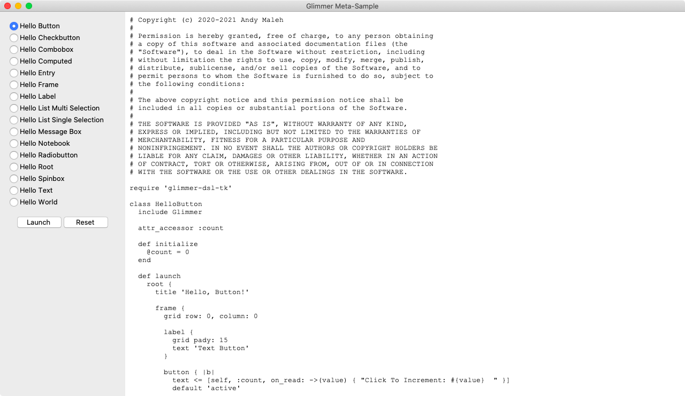

Code:

```ruby
require 'glimmer-dsl-tk'
require 'facets'
require 'fileutils'

class MetaSample
  include Glimmer
  
  attr_accessor :selected_sample_index
  
  def initialize
    @selected_sample_index = 0
  end
  
  def samples
    if @samples.nil?
      sample_files = Dir.glob(File.join(File.expand_path('../hello', __dir__), '**', 'hello_*.rb'))
      sample_file_names = sample_files.map { |f| File.basename(f, '.rb') }
      sample_file_names = sample_file_names.reject { |f| f == 'meta_sample' || f.match(/\d$/) }
      @samples = sample_file_names.map { |f| f.underscore.titlecase }
    end
    @samples
  end
  
  def file_path_for(sample)
    File.join(File.expand_path('../hello', __dir__), "#{sample.underscore}.rb")
  end
  
  def glimmer_dsl_tk_file
    File.expand_path('../../lib/glimmer-dsl-tk', __dir__)
  end
  
  def selected_sample
    samples[@selected_sample_index]
  end
  
  def run_sample(sample)
    Thread.new do
      command = "ruby -r #{glimmer_dsl_tk_file} #{sample} 2>&1"
      result = ''
      IO.popen(command) do |f|
        f.each_line do |line|
          result << line
          puts line
          $stdout.flush
        end
      end
      ::Tk.after(100) do
        message_box(parent: @root, title: 'Error Running Sample', message: result) if result.downcase.include?('error')
      end
    end
  end
  
  def launch
    @root = root {
      title 'Glimmer Meta-Sample'
      width 1280
      height 720
      
      frame {
        grid row: 0, column: 0, column_weight: 0, row_weight: 1
        
        samples.each_with_index do |sample, index|
          radiobutton {
            text sample
            variable <=> [self, :selected_sample_index, on_write: ->(v) {v ? index : selected_sample_index}, on_read: ->(v) {v == index}]
            
            on('command') do
              @selected_sample_index = index
              @code_text.value = File.read(file_path_for(selected_sample))
            end
          }
        end
        
        frame {
          button {
            grid row: 0, column: 0
            text 'Launch'
            
            on('command') do
              begin
                parent_dir = File.join(Dir.home, '.glimmer-dsl-tk', 'samples', 'hello')
                FileUtils.mkdir_p(parent_dir)
                sample_file = File.join(parent_dir, "#{selected_sample.underscore}.rb")
                File.write(sample_file, @code_text.value)
                FileUtils.cp_r(File.expand_path('../../icons', __dir__), File.dirname(File.dirname(parent_dir)))
                FileUtils.cp_r(File.expand_path('../hello/images', __dir__), parent_dir)
                sample_namespace_directory = File.expand_path("../hello/#{selected_sample.underscore}", __dir__)
                FileUtils.cp_r(sample_namespace_directory, parent_dir) if Dir.exist?(sample_namespace_directory)
                run_sample(sample_file)
              rescue => e
                puts e.full_message
                puts 'Unable to write code changes! Running original sample...'
                run_sample(file_path_for(selected_sample))
              end
            end
          }
          button {
            grid row: 0, column: 1
            text 'Reset'
            
            on('command') do
              @code_text.value = File.read(file_path_for(selected_sample))
            end
          }
        }
      }
      
      @code_text = text {
        grid row: 0, column: 1, column_weight: 1
        value File.read(file_path_for(selected_sample))
      }
    }
    @root.open
  end
end

MetaSample.new.launch
```

### Hello, World!

Glimmer code (from [samples/hello/hello_world.rb](samples/hello/hello_world.rb)):

```ruby
require 'glimmer-dsl-tk'

include Glimmer

root {
  title 'Hello, World!'
  
  label {
    text 'Hello, World!'
  }
}.open
```

Run with [glimmer-dsl-tk](https://rubygems.org/gems/glimmer-dsl-tk) gem installed:

```
ruby -r glimmer-dsl-tk -e "require 'samples/hello/hello_world'"
```

Alternatively, run from cloned project without [glimmer-dsl-tk](https://rubygems.org/gems/glimmer-dsl-tk) gem installed:

```
ruby -r ./lib/glimmer-dsl-tk.rb samples/hello/hello_world.rb
```

Glimmer app:


### Hello, Button!

Glimmer code (from [samples/hello/hello_button.rb](samples/hello/hello_button.rb)):

```ruby
require 'glimmer-dsl-tk'

class HelloButton
  include Glimmer
  
  attr_accessor :count
  
  def initialize
    @count = 0
  end
  
  def launch
    root {
      title 'Hello, Button!'
      
      frame {
        grid row: 0, column: 0
        
        label {
          grid pady: 15
          text 'Text Button'
        }
        
        button { |b|
          text <= [self, :count, on_read: ->(value) { "Click To Increment: #{value}  " }]
          default 'active'
          focus true
          
          on('command') do
            self.count += 1
          end
        }
      }
        
      frame {
        grid row: 0, column: 1
        
        label {
          grid pady: 15
          text 'Image Button'
        }
        
        button {
          image File.expand_path('../../icons/glimmer.png', __dir__), subsample: 5
          
          on('command') do
            message_box(title: 'Image Button', message: 'Image Button Clicked!')
          end
        }
      }
      
      frame {
        grid row: 0, column: 2
        
        label {
          grid pady: 15
          text 'Text Image Buttons'
        }
        
        ['center', 'top', 'bottom', 'left', 'right'].each do |compound_option|
          button {
            image File.expand_path('../../icons/glimmer.png', __dir__), subsample: 5
            text "#{compound_option.capitalize} Image"
            compound compound_option
            
            on('command') do
              message_box(title: 'Text Image Button', message: 'Text Image Button Clicked!', detail: "(#{compound_option})")
            end
          }
        end
      }
    }.open
  end
end

HelloButton.new.launch
```

Run with [glimmer-dsl-tk](https://rubygems.org/gems/glimmer-dsl-tk) gem installed:

```
ruby -r glimmer-dsl-tk -e "require 'samples/hello/hello_button'"
```

Alternatively, run from cloned project without [glimmer-dsl-tk](https://rubygems.org/gems/glimmer-dsl-tk) gem installed:

```
ruby -r ./lib/glimmer-dsl-tk.rb samples/hello/hello_button.rb
```

Glimmer app:


### Hello, Checkbutton!

Glimmer code (from [samples/hello/hello_checkbutton.rb](samples/hello/hello_checkbutton.rb)):

```ruby
require 'glimmer-dsl-tk'

class HelloCheckbutton
  class Person
    attr_accessor :skiing, :snowboarding, :snowmobiling, :snowshoeing, :snow_activities, :snow_activities_alternate
    
    def initialize
      reset_activities!
      individual_observer = Glimmer::DataBinding::Observer.proc do
        unless @updating_group
          @updating_individual = true
          if skiing && snowboarding && snowmobiling && snowshoeing
            self.snow_activities = true
            self.snow_activities_alternate = false
          elsif skiing || snowboarding || snowmobiling || snowshoeing
            self.snow_activities = true
            self.snow_activities_alternate = true
          else
            self.snow_activities = false
            self.snow_activities_alternate = false
          end
          @updating_individual = false
        end
      end
      individual_observer.observe(self, :skiing)
      individual_observer.observe(self, :snowboarding)
      individual_observer.observe(self, :snowmobiling)
      individual_observer.observe(self, :snowshoeing)
      
      group_observer = Glimmer::DataBinding::Observer.proc do
        unless @updating_individual
          @updating_group = true
          self.skiing = self.snow_activities
          self.snowboarding = self.snow_activities
          self.snowmobiling = self.snow_activities
          self.snowshoeing = self.snow_activities
          @updating_group = false
        end
      end
      group_observer.observe(self, :snow_activities)
    end
    
    def reset_activities!
      self.snow_activities = true
      self.snow_activities_alternate = true
      self.skiing = false
      self.snowboarding = true
      self.snowmobiling = false
      self.snowshoeing = false
    end
  end
  
  include Glimmer
  
  def initialize
    @person = Person.new
  end
  
  def launch
    root {
      title 'Hello, Checkbutton!'
      background '#ececec' if OS.mac?
      
      label {
        text 'Check all snow activities you are interested in:'
        font 'caption'
      }
      
      frame {
        checkbutton {
          text 'Snow Activities'
          variable <=> [@person, :snow_activities]
          alternate <=> [@person, :snow_activities_alternate] # binds half-checked state
        }
        
        frame {
          checkbutton {
            text 'Skiing'
            variable <=> [@person, :skiing]
          }
          
          checkbutton {
            text 'Snowboarding'
            variable <=> [@person, :snowboarding]
          }
          
          checkbutton {
            text 'Snowmobiling'
            variable <=> [@person, :snowmobiling]
          }
          
          checkbutton {
            text 'Snowshoeing'
            variable <=> [@person, :snowshoeing]
          }
        }
      }
      
      button {
        text 'Reset Activities'
        
        command do
          @person.reset_activities!
        end
      }
    }.open
  end
end

HelloCheckbutton.new.launch
```

Run with [glimmer-dsl-tk](https://rubygems.org/gems/glimmer-dsl-tk) gem installed:

```
ruby -r glimmer-dsl-tk -e "require 'samples/hello/hello_checkbutton'"
```

Alternatively, run from cloned project without [glimmer-dsl-tk](https://rubygems.org/gems/glimmer-dsl-tk) gem installed:

```
ruby -r ./lib/glimmer-dsl-tk.rb samples/hello/hello_checkbutton.rb
```

Glimmer app:


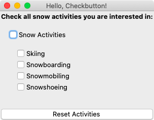

### Hello, Radiobutton!

Glimmer code (from [samples/hello/hello_radiobutton.rb](samples/hello/hello_radiobutton.rb)):

```ruby
require 'glimmer-dsl-tk'

class HelloRadiobutton
  class Person
    attr_accessor :male, :female, :child, :teen, :adult, :senior
    
    def initialize
      reset!
    end
    
    def reset!
      self.male = true
      self.female = nil
      self.child = nil
      self.teen = nil
      self.adult = true
      self.senior = nil
    end
  end
  
  include Glimmer
  
  def initialize
    @person = Person.new
  end
  
  def launch
    root {
      title 'Hello, Radio!'
      background '#ececec' if OS.mac?
      
      label {
        text 'Gender:'
        font 'caption'
      }
      
      frame {
        radiobutton {
          text 'Male'
          variable <=> [@person, :male]
        }
        
        radiobutton {
          text 'Female'
          variable <=> [@person, :female]
        }
      }
      
      label {
        text 'Age Group:'
        font 'caption'
      }
      
      frame {
        radiobutton {
          text 'Child'
          variable <=> [@person, :child]
        }

        radiobutton {
          text 'Teen'
          variable <=> [@person, :teen]
        }

        radiobutton {
          text 'Adult'
          variable <=> [@person, :adult]
        }

        radiobutton {
          text 'Senior'
          variable <=> [@person, :senior]
        }
      }
      
      button {
        text 'Reset'
        
        command do
          @person.reset!
        end
      }
    }.open
  end
end

HelloRadiobutton.new.launch
```

Run with [glimmer-dsl-tk](https://rubygems.org/gems/glimmer-dsl-tk) gem installed:

```
ruby -r glimmer-dsl-tk -e "require 'samples/hello/hello_radiobutton'"
```

Alternatively, run from cloned project without [glimmer-dsl-tk](https://rubygems.org/gems/glimmer-dsl-tk) gem installed:

```
ruby -r ./lib/glimmer-dsl-tk.rb samples/hello/hello_radiobutton.rb
```

Glimmer app:

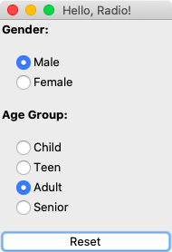

### Hello, Frame!

Glimmer code (from [samples/hello/hello_frame.rb](samples/hello/hello_frame.rb)):

```ruby
require 'glimmer-dsl-tk'

class HelloFrame
  include Glimmer
  
  def launch
    root {
      title 'Hello, Frame!'
      
      frame { # frame simply contains widgets for visual organization via a layout
        relief 'sunken'
        
        label {
          grid row: 0, column: 0, columnspan: 4, padx: 5, pady: 5
          text 'Enter Your Full Name'
          font 'caption'
          anchor 'center'
        }

        label {
          grid row: 1, column: 0, padx: 5
          text "First Name:"
        }
        
        entry {
          grid row: 1, column: 1, padx: 5
        }
        
        label {
          grid row: 2, column: 0, padx: 5
          text "Last Name:"
        }
        
        entry {
          grid row: 2, column: 1, padx: 5
        }
      }
      
      frame { # an empty frame can specify width and height
        grid padx: 7, pady: 7
        width 200
        height 100
        borderwidth 3
        relief 'sunken'
      }
    }.open
  end
end

HelloFrame.new.launch
```

Run with [glimmer-dsl-tk](https://rubygems.org/gems/glimmer-dsl-tk) gem installed:

```
ruby -r glimmer-dsl-tk -e "require 'samples/hello/hello_frame'"
```

Alternatively, run from cloned project without [glimmer-dsl-tk](https://rubygems.org/gems/glimmer-dsl-tk) gem installed:

```
ruby -r ./lib/glimmer-dsl-tk.rb samples/hello/hello_frame.rb
```

Glimmer app:

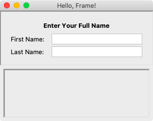

### Hello, Root!

Glimmer code (from [samples/hello/hello_root.rb](samples/hello/hello_root.rb)):

```ruby
require 'glimmer-dsl-tk'

include Glimmer

root { |r|
  title 'Hello, Root!'
  iconphoto File.expand_path('../../icons/glimmer.png', __dir__)
  width 400
  height 200
  x -150
  y 300
  resizable true # same as `resizable true, true`, meaning cannot resize horizontally and vertically
  minsize 200, 100
  maxsize 600, 400
  background 'lightgrey'
  alpha 0.85 # on the mac, you can set `transparent true` as well
  topmost true
  
  on('OPEN_WINDOW') do # custom event that runs right after Tk.mainloop
    message_box(parent: r, title: 'Hi', message: 'Hi')
  end
  
  on('DELETE_WINDOW') do |event| # alias for WM_DELETE_WINDOW protocol event
    message_box(parent: r, title: 'Bye', message: 'Bye')
    exit(0)
  end
}.open
```

Run with [glimmer-dsl-tk](https://rubygems.org/gems/glimmer-dsl-tk) gem installed:

```
ruby -r glimmer-dsl-tk -e "require 'samples/hello/hello_root'"
```

Alternatively, run from cloned project without [glimmer-dsl-tk](https://rubygems.org/gems/glimmer-dsl-tk) gem installed:

```
ruby -r ./lib/glimmer-dsl-tk.rb samples/hello/hello_root.rb
```

Glimmer app:


### Hello, Toplevel!

`toplevel` widgets represent windows nested under `root`, which can be modeless (custom windows) or modal (dialogs that take the focus away from the owning window behind them until closed).

Mac has special support for mac styles in Tk `toplevel` via the `mac_style` attribute, which can receive 1 to 2 arguments. `mac_style`'s first argument (`mac_class`) and second argument (`mac_attribute_list`) can be chosen from this page:

https://wiki.tcl-lang.org/page/MacWindowStyle

Glimmer code (from [samples/hello/hello_toplevel.rb](samples/hello/hello_toplevel.rb)):

```ruby
require 'glimmer-dsl-tk'

include Glimmer

def toplevel_content
  frame {
    label {
      text "This is a fully custom toplevel, meaning you can add any widgets here!\nYou can press the ESCAPE button on the keyboard to close."
    }
    separator
    checkbutton {
      text 'This is a checkbutton'
    }
    radiobutton {
      text 'This is a radiobutton'
    }
  }
end

root { |root_window|
  title 'Hello, Toplevel!'
  
  button {
    text 'Nested Window'
    
    on('command') do
      toplevel(root_window) {
        title 'Custom Window'
        escapable true
        x 150
        y 180
        width 500
        height 200
        minsize 500, 100
        maxsize 1000, 300
          
        toplevel_content
      }
    end
  }
  
  button {
    text 'Transparent Window'
    
    on('command') do
      toplevel(root_window) {
        title 'Transparent Window'
        escapable true
        alpha 0.85
        width 250
        height 100
        resizable false, false # not resizable horizontally or vertically
          
        frame {
          label {
            text "This is a transparent window\nYou can hit ESCAPE to close."
            anchor 'center'
          }
        }
      }
    end
  }
  
  button {
    text 'Fullscreen Window'
    
    on('command') do
      toplevel(root_window) {
        title 'Fullscreen Window'
        escapable true
        fullscreen true
          
        frame {
          label {
            text "This is a fullscreen window\nYou can hit ESCAPE to close."
            anchor 'center'
          }
        }
      }
    end
  }
  
  if OS.mac?
    # Mac has special support for mac styles in Tk `toplevel`
    # `mac_style` first argument (`mac_class`) and second argument (`mac_attribute_list`) can be chosen from this page: https://wiki.tcl-lang.org/page/MacWindowStyle
    
    button {
      text 'Mac Plain (No-Button-Modeless) Window'
      
      on('command') do
        toplevel(root_window) { |t|
          title 'Mac Plain (No-Button-Modeless) Window'
          escapable true
          mac_style 'plain'
          
          toplevel_content
        }
      end
    }
    
    button {
      text 'Mac Floating (Close-Button-Modeless) Window'
      
      on('command') do
        toplevel(root_window) { |t|
          title 'Mac Floating (Close-Button-Modeless) Window'
          escapable true
          mac_style 'floating'
          
          toplevel_content
        }
      end
    }
    
    button {
      text 'Mac Document (All-Button-Modeless) Window'
      
      on('command') do
        toplevel(root_window) { |t|
          title 'Mac Document (All-Button-Modeless) Window'
          escapable true
          mac_style 'document'
          
          toplevel_content
        }
      end
    }
    
    button {
      text 'Mac Utility (Close-Button-Modal) Dialog'
      
      on('command') do
        toplevel(root_window) { |t|
          title 'Mac Utility (Close-Button-Modal) Dialog'
          escapable true
          mac_style 'utility'
          
          toplevel_content
        }
      end
    }
    
    button {
      text 'Mac Utility with Attribute List (All-Button-Modal) Dialog'
      
      on('command') do
        toplevel(root_window) { |t|
          title 'Mac Utility with Attribute List (All-Button-Modal) Dialog'
          escapable true
          mac_style 'utility', 'closeBox collapseBox resizable horizontalZoom verticalZoom sideTitlebar'
          
          toplevel_content
        }
      end
    }
  end
}.open
```

Run with [glimmer-dsl-tk](https://rubygems.org/gems/glimmer-dsl-tk) gem installed:

```
ruby -r glimmer-dsl-tk -e "require 'samples/hello/hello_toplevel'"
```

Alternatively, run from cloned project without [glimmer-dsl-tk](https://rubygems.org/gems/glimmer-dsl-tk) gem installed:

```
ruby -r ./lib/glimmer-dsl-tk.rb samples/hello/hello_toplevel.rb
```

Glimmer app:

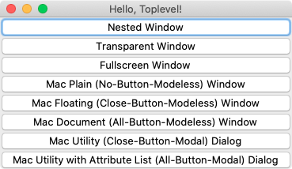

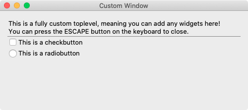


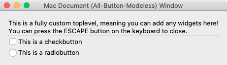


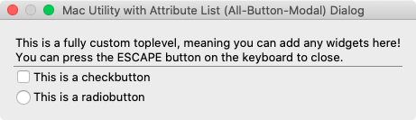

### Hello, Notebook!

Glimmer code (from [samples/hello/hello_notebook.rb](samples/hello/hello_notebook.rb)):

```ruby
require 'glimmer-dsl-tk'

class HelloNotebook
  include Glimmer
  
  def launch
    root {
      title 'Hello, Notebook!'
       
      notebook {
        frame(text: 'English') {
          label {
            text 'Hello, World!'
          }
        }
         
        frame(text: 'French') {
          label {
            text 'Bonjour, Univers!'
          }
        }
      }
    }.open
  end
end

HelloNotebook.new.launch
```

Run with [glimmer-dsl-tk](https://rubygems.org/gems/glimmer-dsl-tk) gem installed:

```
ruby -r glimmer-dsl-tk -e "require 'samples/hello/hello_notebook'"
```

Alternatively, run from cloned project without [glimmer-dsl-tk](https://rubygems.org/gems/glimmer-dsl-tk) gem installed:

```
ruby -r ./lib/glimmer-dsl-tk.rb samples/hello/hello_notebook.rb
```

Glimmer app:


### Hello, Label!

Icons used in this sample were made by <a href="https://www.flaticon.com/authors/freepik" title="Freepik">Freepik</a> from <a href="https://www.flaticon.com/" title="Flaticon"> www.flaticon.com</a>

Glimmer code (from [samples/hello/hello_label.rb](samples/hello/hello_label.rb)):

```ruby
require 'glimmer-dsl-tk'

class HelloLabel
  include Glimmer
  
  LABEL_FONTS = ['default', 'text', 'fixed', 'menu', 'heading', 'caption', 'small_caption', 'icon', 'tooltip']
  LABEL_RELIEFS = ['flat', 'raised', 'sunken', 'solid', 'ridge', 'groove']
  
  def launch
    root {
      title 'Hello, Label!'
      
      notebook {
        frame(text: 'left-aligned') {
          3.times do |n|
            label {
              text "Field #{n + 1} / default font / flat relief"
              width 60
              anchor 'w'
            }
          end
        }
        
        frame(text: 'centered') {
          9.times do |n|
            label {
              text "Field #{n + 1} / fixed font / raised relief"
              width 80
              anchor 'center'
              font 'fixed'
              relief 'raised'
            }
          end
        }
        
        frame(text: 'right-aligned') {
          9.times do |n|
            label {
              text "Field #{n + 1} / small_caption font / ridge relief"
              width 80
              anchor 'e'
              font 'small_caption'
              relief 'ridge'
            }
          end
        }
        
        frame(text: 'justified') {
          label {
            text <<~MULTI_LINE_STRING
              This is a very long paragraph that spans multiple lines. It looks better and
              is easier to read when justified. In fact, this is how to make it look like a
              new paper column. That results in professional looking text. Magazines use the
              same sort of justified text. Word processors also support justified text. In
              fact, this is how text is made for news papers and magainzes, and then published
              in paper form and digitally.
            MULTI_LINE_STRING
            width 60
            anchor 'center'
            justify 'center' # other options are: 'left' and 'right'
            font 'caption' # other options are: 'default', 'text', 'fixed', 'menu', 'heading', 'small_caption', 'icon', 'tooltip'
            foreground 'blue'
            relief 'sunken' # other options are: 'flat' (default), 'raised', 'solid', 'ridge', 'groove'
          }
        }
        
        frame(text: 'images') {
          ['denmark', 'finland', 'norway'].each do |image_name|
            label {
              image File.expand_path("images/#{image_name}.png", __dir__)
            }
          end
        }
        
        frame(text: 'background images') {
          ['italy', 'france', 'mexico'].each do |image_name|
            label {
              text image_name.capitalize
              image File.expand_path("images/#{image_name}.png", __dir__)
              compound 'center'
            }
          end
        }
      }
    }.open
  end
end

HelloLabel.new.launch
```

Run with [glimmer-dsl-tk](https://rubygems.org/gems/glimmer-dsl-tk) gem installed:

```
ruby -r glimmer-dsl-tk -e "require 'samples/hello/hello_label'"
```

Alternatively, run from cloned project without [glimmer-dsl-tk](https://rubygems.org/gems/glimmer-dsl-tk) gem installed:

```
ruby -r ./lib/glimmer-dsl-tk.rb samples/hello/hello_label.rb
```

Glimmer app:


### Hello, Message Box!

Glimmer code (from [samples/hello/hello_message_box.rb](samples/hello/hello_message_box.rb)):

```ruby
root { |r|
  title 'Hello, Message Box!'
  
  frame {
    button {
      text 'Please Click To Win a Surprise'
      
      command {
        # specifying parent ensures dialog shows up centered on top of window (instead of centered in display monitor)
        @result_label.text = message_box(parent: r, title: 'Surprise', message: "Congratulations!\n\nYou won $1,000,000!") # type: 'ok' by default
      }
    }
    
    button {
      text 'Download Software Update'
      
      command {
        @result_label.text = message_box(type: 'okcancel', title: 'Software Update', message: "We will begin to download software update.")
      }
    }
    
    button {
      text 'Format Hard Drive'
      
      command {
        @result_label.text = message_box(type: 'yesno', icon: 'question', title: 'Format', message: "Would you like to format your hard drive?")
      }
    }
    
    button {
      text 'Submit Application'
      
      command {
        @result_label.text = message_box(type: 'yesnocancel', icon: 'question', title: 'Application', message: "Would you like to review application before submitting?")
      }
    }
    
    button {
      text 'Play Video'
      
      command {
        @result_label.text = message_box(type: 'retrycancel', icon: 'error', title: 'Video Replay', message: "Video has failed to play. Would you like to retry?")
      }
    }
    
    button {
      text 'Installation Completed'
      
      command {
        @result_label.text = message_box(type: 'abortretryignore', icon: 'warning', default: 'ignore', title: 'Failed To Install Extra Utilities', message: "Installation is complete, but extra utilities have failed to install. Would you like to retry installing extra utilities?", detail: 'Encountered network error in downloading extra utilities, resulting in failure to install them')
      }
    }
  }
  
  frame {
    label {
      grid row: 0, column: 0
      text 'Result:'
    }
    
    @result_label = label {
      grid row: 0, column: 1
    }
  }
}.open
```

Run with [glimmer-dsl-tk](https://rubygems.org/gems/glimmer-dsl-tk) gem installed:

```
ruby -r glimmer-dsl-tk -e "require 'samples/hello/hello_message_box'"
```

Alternatively, run from cloned project without [glimmer-dsl-tk](https://rubygems.org/gems/glimmer-dsl-tk) gem installed:

```
ruby -r ./lib/glimmer-dsl-tk.rb samples/hello/hello_message_box.rb
```

Glimmer app:

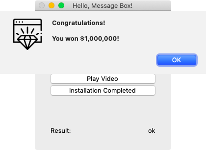

### Hello, Combobox!

Glimmer code (from [samples/hello/hello_combobox.rb](samples/hello/hello_combobox.rb)):

```ruby
# ... more code precedes
root {
  title 'Hello, Combobox!'
  
  combobox {
    readonly true # this applies to text editing only (item selection still triggers a write to model)
    text <=> [person, :country]
  }
  
  button {
    text "Reset Selection"
    command {
      person.reset_country
    }
  }
}.open
# ... more code follows
```

Run with [glimmer-dsl-tk](https://rubygems.org/gems/glimmer-dsl-tk) gem installed:

```
ruby -r glimmer-dsl-tk -e "require 'samples/hello/hello_combobox'"
```

Alternatively, run from cloned project without [glimmer-dsl-tk](https://rubygems.org/gems/glimmer-dsl-tk) gem installed:

```
ruby -r ./lib/glimmer-dsl-tk.rb samples/hello/hello_combobox.rb
```

Glimmer app:


### Hello, List Single Selection!

Glimmer code (from [samples/hello/hello_list_single_selection.rb](samples/hello/hello_list_single_selection.rb)):

```ruby
# ... more code precedes
root {
  title 'Hello, List Single Selection!'
  
  list {
    selectmode 'browse'
    selection <=> [person, :country]
  }
  
  button {
    text "Reset Selection To Default Value"
    
    command { person.reset_country }
  }
}.open
# ... more code follows
```

Run with [glimmer-dsl-tk](https://rubygems.org/gems/glimmer-dsl-tk) gem installed:

```
ruby -r glimmer-dsl-tk -e "require 'samples/hello/hello_list_single_selection'"
```

Alternatively, run from cloned project without [glimmer-dsl-tk](https://rubygems.org/gems/glimmer-dsl-tk) gem installed:

```
ruby -r ./lib/glimmer-dsl-tk.rb samples/hello/hello_list_single_selection.rb
```

Glimmer app:


### Hello, List Multi Selection!

Glimmer code (from [samples/hello/hello_list_multi_selection.rb](samples/hello/hello_list_multi_selection.rb)):

```ruby
# ... more code precedes
root {
  title 'Hello, List Multi Selection!'
  
  list {
    selection <=> [person, :provinces]
  }
  
  button {
    text "Reset Selection To Defaults"
    
    command { person.reset_provinces }
  }
}.open
# ... more code follows
```

Run with [glimmer-dsl-tk](https://rubygems.org/gems/glimmer-dsl-tk) gem installed:

```
ruby -r glimmer-dsl-tk -e "require 'samples/hello/hello_list_multi_selection'"
```

Alternatively, run from cloned project without [glimmer-dsl-tk](https://rubygems.org/gems/glimmer-dsl-tk) gem installed:

```
ruby -r ./lib/glimmer-dsl-tk.rb samples/hello/hello_list_multi_selection.rb
```

Glimmer app:


### Hello, Entry!

Glimmer code (from [samples/hello/hello_entry.rb](samples/hello/hello_entry.rb)):

```ruby
require 'glimmer-dsl-tk'

class HelloEntry
  include Glimmer
  
  attr_accessor :default, :password, :telephone, :read_only
  
  def initialize
    self.default = 'default'
    self.password = 'password'
    self.telephone = '555-555-5555'
    self.read_only = 'Telephone area code is 555'
  end
  
  def launch
    root {
      title 'Hello, Entry!'
      
      label {
        grid sticky: 'ew'
        text 'default entry'
      }
      entry {
        grid sticky: 'ew'
        text <=> [self, :default]
      }
      
      label {
        grid sticky: 'ew'
        text 'password entry'
      }
      entry {
        grid sticky: 'ew'
        show '*'
        text <=> [self, :password]
      }

      @validated_entry_label = label {
        grid sticky: 'ew'
        text 'entry with event handlers'
      }
      entry {
        grid sticky: 'ew'
        text <=> [self, :telephone]
        validate 'key'

        ## this event kicks in just after the user typed and before modifying the text variable
        on('validate') do |new_text_variable|
          telephone?(new_text_variable.value)
        end

        ## this event kicks in just after the text variable is validated and before it is modified
        on('invalid') do |validate_args|
          @validated_entry_label.text = "#{validate_args.string} is not valid!"
          @validated_entry_label.foreground = 'red'
        end

        ## this event kicks in just after the text variable is validated and modified
        on('change') do |new_text_variable|
          self.read_only = "Telephone area code is #{new_text_variable.value.gsub(/[^0-9]/, '')[0...3]}"
          @validated_entry_label.text = 'entry with event handlers'
          @validated_entry_label.foreground = nil
        end
      }

      label {
        grid sticky: 'ew'
        text 'read-only entry'
      }
      entry {
        grid sticky: 'ew'
        text <=> [self, :read_only]
        readonly true
      }
    }.open
  end
  
  def telephone?(text)
    !!text.match(/^\d{0,3}[-.\/]?\d{0,3}[-.\/]?\d{0,4}$/)
  end
end

HelloEntry.new.launch
```

Run with [glimmer-dsl-tk](https://rubygems.org/gems/glimmer-dsl-tk) gem installed:

```
ruby -r glimmer-dsl-tk -e "require 'samples/hello/hello_entry'"
```

Alternatively, run from cloned project without [glimmer-dsl-tk](https://rubygems.org/gems/glimmer-dsl-tk) gem installed:

```
ruby -r ./lib/glimmer-dsl-tk.rb samples/hello/hello_entry.rb
```

Glimmer app:


### Hello, Text!

You may press META+F to bring up the Find Dialog on the Mac and CONTROL+F to bring it up on Windows/Linux.

Icons used in this sample were made by <a href="https://www.flaticon.com/authors/freepik" title="Freepik">Freepik</a> from <a href="https://www.flaticon.com/" title="Flaticon"> www.flaticon.com</a>

Glimmer code (from [samples/hello/hello_text.rb](samples/hello/hello_text.rb)):

```ruby
require 'glimmer-dsl-tk'

class HelloText
  include Glimmer
  
  COLOR_OPTIONS = %w[black purple blue green orange yellow red white].map(&:capitalize)
  FONT_FAMILY_OPTIONS = ::TkFont.families
  FOREGROUND_PROMPT = '<foreground>'
  BACKGROUND_PROMPT = '<background>'
  FONT_FAMILY_PROMPT = '<font family>'
  FONT_SIZE_PROMPT = '<font size>'
  
  def initialize
    @foreground = FOREGROUND_PROMPT
    @background = BACKGROUND_PROMPT
    @font_family = FONT_FAMILY_PROMPT
    @font_size = FONT_SIZE_PROMPT
    @document = <<~MULTI_LINE_STRING
      According to the National Post, a heavy metal-loving high school principal in Canada will be allowed to keep her job, days after a public campaign to oust her made headlines around the globe.
      
      Parents at Eden High School in St. Catharines, Ontario launched a petition to remove principal Sharon Burns after discovering she's an IRON MAIDEN fan.
      
      The petition, titled "Eden High School Principal, Sharon Burns, Needs to Be Transferred Immediately!" read, "We are deeply disturbed that the principal assigned to the school blatantly showed Satanic symbols and her allegiance to Satanic practices on her public social media platforms where all the students can see them under @edenprincipal (not her personal account)."
      
      More than 500 people signed the petition to transfer Burns after she posted a picture of herself flashing the "devil horns" hand sign with a doll of the MAIDEN zombie mascot Eddie behind her as well as a personalized license plate reading "IRNMADEN" and a handwritten note that reads "Eddie 666" on a car's dashboard.
      
      
      The number 666 is used to represent the devil, and is featured prominently in MAIDEN's artwork by the band, whose classic third album is titled "The Number Of The Beast".
      
      The petition was later updated to state that the demand for her transfer is not because of her love for metal, but for "openly displaying her own handmade sign with the 666 clearly displayed on it".
      
      The creator of the original petition wrote: "Sharon knows full well what she did was simply inappropriate, unnecessary and not professional but has yet to publicly admit so and is willing to allow people to believe a completely different story, making very real concerns seem petty."
      
      Meanwhile, a counter-petition supporting Burns garnered over 20,000 signatures.
      
      "It is ridiculous that a couple of parents judge her role as a principal only based on an Instagram post. (About liking the band IRON MAIDEN. That's it.) Eden High School is a public school. Not a Christian school," the petition titled "We need Mrs Burns" stated. "She has made Eden a safe space for so many people. She spreads nothing but love and kindness."
      
      After the complaints were aired, the District School Board of Niagara spoke with Burns and the parents who launched the petition, and the issue is over as far as the board is concerned, Kim Sweeney, the board's chief communications officer, told the National Post. No disciplinary action or policy changes were needed.
      
      "Our belief is that taste in music is subjective and we support that both students and staff enjoy a wide variety of genres," Sweeney said.
      
      The original petition has since been removed.
    MULTI_LINE_STRING
  end
  
  attr_accessor :document, :find_text
      
  attr_accessor :foreground
  
  def foreground_options
    [FOREGROUND_PROMPT] + COLOR_OPTIONS
  end
  
  attr_accessor :background
  
  def background_options
    [BACKGROUND_PROMPT] + COLOR_OPTIONS
  end
  
  attr_accessor :font_family
  
  def font_family_options
    [FONT_FAMILY_PROMPT] + FONT_FAMILY_OPTIONS
  end
  
  attr_accessor :font_size
  
  def font_size_options
    [FONT_SIZE_PROMPT] + (9..64).to_a.map(&:to_s)
  end
  
  def find
    text_index = @text.search(/#{find_text}/i, @text.tag_ranges('sel')&.first&.last || @text.index('insert'))
    unless text_index.to_s.empty?
      @text.tag_remove('sel', '1.0', 'end')
      @text.tag_add('sel', text_index, "#{text_index} + #{find_text.size} chars")
    end
  end
  
  def launch
    @root = root {
      title 'Hello, Text!'
      width 1280
      height 800
      
      frame {
        grid row: 0, column: 0
        
        column_index = -1
        
        combobox { |cb|
          grid row: 1, column: column_index += 1, column_weight: 1
          readonly true
          text <=> [self, :font_family, after_write: ->(value) { @text.toggle_selection_font_format('family', value == FONT_FAMILY_PROMPT ? 'Courier New' : value, focus: 100) }]
        }
        
        combobox {
          grid row: 1, column: column_index += 1, column_weight: 1
          readonly true
          text <=> [self, :font_size, after_write: ->(value) { @text.toggle_selection_font_format('size', value == FONT_SIZE_PROMPT ? 13 : value, focus: 100) }]
        }
        
        combobox {
          grid row: 1, column: column_index += 1, column_weight: 1
          readonly true
          text <=> [self, :foreground, after_write: ->(value) { @text.add_selection_format('foreground', value == FOREGROUND_PROMPT ? 'black' : value, focus: 100) }]
        }
        
        combobox {
          grid row: 1, column: column_index += 1, column_weight: 1
          readonly true
          text <=> [self, :background, after_write: ->(value) { @text.add_selection_format('background', value == BACKGROUND_PROMPT ? 'white' : value, focus: 100) }]
        }
        
        separator {
          grid row: 1, column: column_index += 1, column_weight: 0
          orient 'vertical'
        }
        
        @bold_button = button {
          grid row: 1, column: column_index += 1, column_weight: 0
          text 'B'
          style font: {weight: 'bold'}
          
          on('command') do
            @text.toggle_selection_font_format('weight', 'bold')
          end
        }
        
        @italic_button = button {
          grid row: 1, column: column_index += 1, column_weight: 0
          text 'I'
          style font: {slant: 'italic'}
          
          on('command') do
            @text.toggle_selection_font_format('slant', 'italic')
          end
        }
        
        @underline_button = button {
          grid row: 1, column: column_index += 1, column_weight: 0
          text 'U'
          style font: {underline: true}
          
          on('command') do
            @text.toggle_selection_font_format('underline', true)
          end
        }

        separator {
          grid row: 1, column: column_index += 1, column_weight: 0
          orient 'vertical'
        }
        
        @justify_left_button = button {
          grid row: 1, column: column_index += 1, column_weight: 0
          image File.expand_path("images/align-left.png", __dir__), subsample: 32
          
          on('command') do
            @text.add_selection_format('justify', 'left')
          end
        }
        
        @justify_center_button = button {
          grid row: 1, column: column_index += 1, column_weight: 0
          image File.expand_path("images/align-center.png", __dir__), subsample: 32
          
          on('command') do
            @text.add_selection_format('justify', 'center')
          end
        }
        
        @justify_right_button = button {
          grid row: 1, column: column_index += 1, column_weight: 0
          image File.expand_path("images/align-right.png", __dir__), subsample: 32
          
          on('command') do
            @text.add_selection_format('justify', 'right')
          end
        }
        
        separator {
          grid row: 1, column: column_index += 1, column_weight: 0
          orient 'vertical'
        }
        
        button {
          grid row: 1, column: column_index += 1, column_weight: 0
          image File.expand_path("images/picture.png", __dir__), subsample: 32
          
          on('command') do
            @text.get_open_file_to_insert_image
          end
        }
        
        button {
          grid row: 1, column: column_index += 1, column_weight: 0
          image File.expand_path("images/search.png", __dir__), subsample: 32
          
          on('command') do
            show_find_dialog
          end
        }
        
        separator {
          grid row: 1, column: column_index += 1, column_weight: 0
          orient 'vertical'
        }
        
        button {
          grid row: 1, column: column_index += 1, column_weight: 0
          image File.expand_path("images/cut.png", __dir__), subsample: 32
          
          on('command') do
            @text.text_cut
          end
        }
        
        button {
          grid row: 1, column: column_index += 1, column_weight: 0
          image File.expand_path("images/copy.png", __dir__), subsample: 32
          
          on('command') do
            @text.text_copy
          end
        }
        
        button {
          grid row: 1, column: column_index += 1, column_weight: 0
          image File.expand_path("images/paste.png", __dir__), subsample: 32
          
          on('command') do
            @text.text_paste
          end
        }
        
        separator {
          grid row: 1, column: column_index += 1, column_weight: 0
          orient 'vertical'
        }
        
        
        button {
          grid row: 1, column: column_index += 1, column_weight: 0
          image File.expand_path("images/undo.png", __dir__), subsample: 32
          
          on('command') do
            @text.edit_undo
          end
        }
        
        button {
          grid row: 1, column: column_index += 1, column_weight: 0
          image File.expand_path("images/redo.png", __dir__), subsample: 32
          
          on('command') do
            @text.edit_redo
          end
        }
      }
      
      @text = text {
        grid row: 1, column: 0, row_weight: 1
        wrap 'word'
        undo true
        value <=> [self, :document]
        
        on('InsertMarkMoved') do
          self.font_family = @text.applied_font_format_value('family')
          self.font_size = @text.applied_font_format_value('size')
          @bold_button.default = @text.applied_font_format_value('weight') == 'bold' ? 'active' : 'normal'
          @italic_button.default = @text.applied_font_format_value('slant') == 'italic' ? 'active' : 'normal'
          @underline_button.default = @text.applied_font_format_value('underline') == true ? 'active' : 'normal'
          self.background = @text.applied_format_value('background')
          self.foreground = @text.applied_format_value('foreground')
          @justify_left_button.default = @text.applied_format_value('justify') == 'left' ? 'active' : 'normal'
          @justify_center_button.default = @text.applied_format_value('justify') == 'center' ? 'active' : 'normal'
          @justify_right_button.default = @text.applied_format_value('justify') == 'right' ? 'active' : 'normal'
        end
        
        on('KeyPress') do |event|
          show_find_dialog if (event.keysym == 'f') && ((OS.mac? && event.state == 8) || (!OS.mac? && event.state == 4))
        end
      }
    }
    @root.open
  end
  
  def show_find_dialog
    toplevel(@root) { |tl|
      title 'Find'
      
      label {
        text 'Text:'
      }
      entry { |e|
        focus true
        text <=> [
          self,
          :find_text,
          after_write: lambda do
            text_index = @text.search(/#{find_text}/i, 'insert')
            unless text_index.to_s.empty?
              @text.tag_remove('sel', '1.0', 'end')
              @text.tag_add('sel', text_index, "#{text_index} + #{find_text.size} chars")
            end
          end
        ]
                
        on('KeyPress') do |event|
          if event.keysym == 'Return'
            find
          elsif event.keysym == 'Escape'
            tl.grab_release
            tl.destroy
          end
        end
      }
      button {
        text 'Find'
        default 'active'
        
        on('command') do
          find
        end
      }
    }
  end
end

HelloText.new.launch
```

Run with [glimmer-dsl-tk](https://rubygems.org/gems/glimmer-dsl-tk) gem installed:

```
ruby -r glimmer-dsl-tk -e "require 'samples/hello/hello_text'"
```

Alternatively, run from cloned project without [glimmer-dsl-tk](https://rubygems.org/gems/glimmer-dsl-tk) gem installed:

```
ruby -r ./lib/glimmer-dsl-tk.rb samples/hello/hello_text.rb
```

Glimmer app:

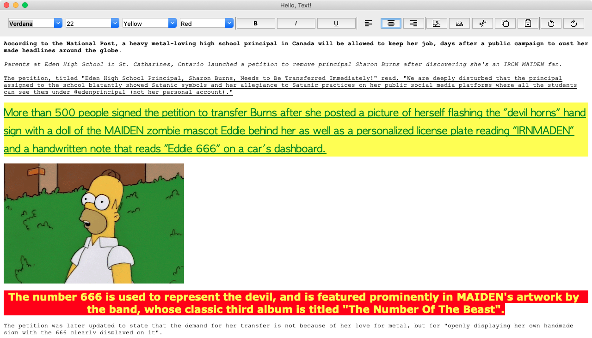


### Hello, Spinbox!

Glimmer code (from [samples/hello/hello_spinbox.rb](samples/hello/hello_spinbox.rb)):

```ruby
require 'glimmer-dsl-tk'

class HelloSpinbox
  class Person
    attr_accessor :donation
  end
  
  include Glimmer
  
  def initialize
    @person = Person.new
    @person.donation = 5.0 # in dollars
  end
  
  def launch
    root {
      title 'Hello, Spinbox!'
      
      label {
        text 'Please select the amount you would like to donate to the poor:'
      }
      
      frame {
        label {
          grid row: 0, column: 0
          text 'Amount:'
          font 'caption'
        }
        
        label {
          grid row: 0, column: 1
          text '$'
        }
        
        spinbox { |sb|
          grid row: 0, column: 2
          from 1.0 # minimum value
          to 150.0 # maximum value
          increment 5.0 # increment on up and down
          format '%0.2f'
          text <=> [@person, :donation]
        }
        
        label {
          grid row: 1, column: 0, columnspan: 3
          text <=> [@person, :donation, on_read: ->(value) { "Thank you for your donation of $#{"%.2f" % value.to_f}"}]
        }

      }
    }.open
  end
end

HelloSpinbox.new.launch
```

Run with [glimmer-dsl-tk](https://rubygems.org/gems/glimmer-dsl-tk) gem installed:

```
ruby -r glimmer-dsl-tk -e "require 'samples/hello/hello_spinbox'"
```

Alternatively, run from cloned project without [glimmer-dsl-tk](https://rubygems.org/gems/glimmer-dsl-tk) gem installed:

```
ruby -r ./lib/glimmer-dsl-tk.rb samples/hello/hello_spinbox.rb
```

Glimmer app:


### Hello, Computed!

Glimmer code (from [samples/hello/hello_computed.rb](samples/hello/hello_computed.rb)):

```ruby
# ... more code precedes
    root {
      title 'Hello, Computed!'
      
      frame {
        grid column: 0, row: 0, padx: 5, pady: 5
        
        label {
          grid column: 0, row: 0, sticky: 'w'
          text 'First Name: '
        }
        entry {
          grid column: 1, row: 0
          width 15
          text <=> [@contact, :first_name]
        }
        
        label {
          grid column: 0, row: 1, sticky: 'w'
          text 'Last Name: '
        }
        entry {
          grid column: 1, row: 1
          width 15
          text <=> [@contact, :last_name]
        }
        
        label {
          grid column: 0, row: 2, sticky: 'w'
          text 'Year of Birth: '
        }
        entry {
          grid column: 1, row: 2
          width 15
          text <=> [@contact, :year_of_birth]
        }
        
        label {
          grid column: 0, row: 3, sticky: 'w'
          text 'Name: '
        }
        label {
          grid column: 1, row: 3, sticky: 'w'
          text <=> [@contact, :name, computed_by: [:first_name, :last_name]]
        }
        
        label {
          grid column: 0, row: 4, sticky: 'w'
          text 'Age: '
        }
        label {
          grid column: 1, row: 4, sticky: 'w'
          text <=> [@contact, :age, on_write: :to_i, computed_by: [:year_of_birth]]
        }
      }
    }.open
# ... more code follows
```

Run with [glimmer-dsl-tk](https://rubygems.org/gems/glimmer-dsl-tk) gem installed:

```
ruby -r glimmer-dsl-tk -e "require 'samples/hello/hello_computed'"
```

Alternatively, run from cloned project without [glimmer-dsl-tk](https://rubygems.org/gems/glimmer-dsl-tk) gem installed:

```
ruby -r ./lib/glimmer-dsl-tk.rb samples/hello/hello_computed.rb
```

Glimmer app:


### Hello, Drag and Drop!

Glimmer code (from [samples/hello/hello_drag_and_drop.rb](samples/hello/hello_drag_and_drop.rb)):

```ruby
require 'glimmer-dsl-tk'

include Glimmer

root {
  title "Hello, Drag and Drop!"
  
  frame {
    padding 5
    
    labelframe {
      text "Drag sources"
      padding 5
      
      label {
        grid :row => 0, :column => 0
        text "Label"
      }
      label {
        grid :row => 0, :column => 1, :pady => 10, :sticky => "e"
        text "Drag label text"
        width 30
        drag_source true
      }
      
      label {
        grid :row => 1, :column => 0
        text "Entry"
      }
      entry {
        grid :row => 1, :column => 1, :pady => 5, :sticky => "e"
        text "Drag entry text"
        width 30
        
        # drag_source true
        # This is how to do `drag_source true` the manual way for use in exceptional cases
        on('drag_start') do |event|
          event.data = event.source.text
          event.source.configure(:cursor => "hand2")
          event.tooltip.content { # re-open tooltip content and add a label
            lbl { # non-tile-theme version of label
              text event.data + " "
              bg "yellow"
              bitmap "warning"
              compound "right"
            }
          }
        end
        on('drag_motion') do |event|
          if event.drop_accepted?
            event.source.configure(:cursor => "hand1")
          else
            event.source.configure(:cursor => "hand2")
          end
          event.tooltip.geometry("+#{event.x_root + 10}+#{event.y_root - 4}")
        end
      }
      
      label {
        grid :row => 2, :column => 0
        text "Combobox"
      }
      combobox {
        grid :row => 2, :column => 1, :pady => 5, :sticky => "e"
        text "Spain"
        values %w[USA Canada Mexico Columbia UK Australia Germany Italy Spain]
        width 27
        
        drag_source true
      }
      
      label {
        grid :row => 3, :column => 0
        text 'List'
      }
      list {
        grid :row => 3, :column => 1, :pady => 5, :sticky => "e"
        selectmode 'browse'
        items %w[USA Canada Mexico]
        selection 'Canada'
        height 3
        
        # drag_source true
        # This is another alternative to `drag_source true` with manual specification of transferred data only
        on('drag_start') do |event|
          event.data = event.source.selection.first
        end
      }
      
      label {
        grid :row => 4, :column => 0
        text "Button"
      }
      button {
        grid :row => 4, :column => 1, :pady => 5, :sticky => "w"
        text "Drag it"
        drag_source true
      }
    }

    labelframe {
      grid :sticky => "nsew", :pady => 15
      text "Drop targets"
      padding 5
      
      label {
        grid :row => 0, :column => 0
        text "Label"
      }
      label {
        grid :row => 0, :column => 1, :pady => 10, :sticky => "e"
        width 30
        borderwidth 2
        relief "solid"
        
        drop_target true
      }
      
      label {
        grid :row => 1, :column => 0
        text "Entry"
      }
      entry {
        grid :row => 1, :column => 1, :pady => 5, :sticky => "e"
        width 30
        
        drop_target true
      }
      
      label {
        grid :row => 2, :column => 0
        text "Combobox"
      }
      combobox {
        grid :row => 2, :column => 1, :pady => 5, :sticky => "e"
        width 27
        
        drop_target true
      }
      
      label {
        grid :row => 3, :column => 0
        text 'List'
      }
      list {
        grid :row => 3, :column => 1, :pady => 5, :sticky => "e"
        selectmode 'browse'
        height 3
        
        drop_target true
      }
      
      label {
        grid :row => 4, :column => 0
        text "Button"
      }
      button {
        grid :row => 4, :column => 1, :pady => 5, :sticky => "w"
        text "Drop here"
        
        drop_target true
      }
      
      label {
        grid :row => 5, :column => 0
        text "Checkbutton"
      }
      checkbutton {
        grid :row => 5, :column => 1, :pady => 5, :sticky => "w"
        text "Drop here to destroy a widget"

        # drop_target true
        # This is an alternative to `drop_target true` with manual consumption of transferred data
        on('drop') do |event|
          event.target.text = event.data
          # execute asynchronously after 100ms to ensure all events have been processed before destruction
          ::Tk.after(100) {event.source.destroy}
        end
      }
    }
  }
}.open
```

Run with [glimmer-dsl-tk](https://rubygems.org/gems/glimmer-dsl-tk) gem installed:

```
ruby -r glimmer-dsl-tk -e "require 'samples/hello/hello_drag_and_drop'"
```

Alternatively, run from cloned project without [glimmer-dsl-tk](https://rubygems.org/gems/glimmer-dsl-tk) gem installed:

```
ruby -r ./lib/glimmer-dsl-tk.rb samples/hello/hello_drag_and_drop.rb
```

Glimmer app:


### Hello, Built-in Dialog!

Glimmer code (from [samples/hello/hello_built_in_dialog.rb](samples/hello/hello_built_in_dialog.rb)):

```ruby
require 'glimmer-dsl-tk'

include Glimmer

root { |w|
  title 'Hello, Built-in Dialog!'
  width 400
  height 400
  x 150
  y 150
  
  frame {
    %w[get_open_file get_multiple_open_file get_save_file choose_directory choose_color].each do |dialog|
      button {
        text dialog.split('_').map(&:capitalize).join(' ')
        
        on('command') do
          result = send(dialog, parent: w)
          @result_label.text = [result].flatten.join("\n")
        end
      }
    end
    
    button {
      text 'Choose Font'
      
      on('command') do
        choose_font(family: 'Courier New', size: '30', weight: 'bold') do |chosen_font|
          @result_label.text = chosen_font
        end
      end
    }
  }
  
  frame {
    grid sticky: 'nsew', padx: 15, pady: 15
    
    label {
      grid row: 0, column: 0
      text 'Result:'
    }
    
    @result_label = label {
      grid row: 0, column: 1
    }
  }
}.open
```

Run with [glimmer-dsl-tk](https://rubygems.org/gems/glimmer-dsl-tk) gem installed:

```
ruby -r glimmer-dsl-tk -e "require 'samples/hello/hello_built_in_dialog'"
```

Alternatively, run from cloned project without [glimmer-dsl-tk](https://rubygems.org/gems/glimmer-dsl-tk) gem installed:

```
ruby -r ./lib/glimmer-dsl-tk.rb samples/hello/hello_built_in_dialog.rb
```

Glimmer app:


### Hello, Separator!

Glimmer code (from [samples/hello/hello_separator.rb](samples/hello/hello_separator.rb)):

```ruby
require 'glimmer-dsl-tk'

include Glimmer

root {
  title 'Hello, Separator!'
  width 200
  height 200
  
  label {
    grid row: 0, column: 0, min_width: 100, min_height: 100, column_weight: 0, sticky: 'nsew'
    text 'Label 1'
    anchor 'center'
  }
  
  separator {
    grid row: 0, column: 1
    orient 'vertical'
  }
  
  label {
    grid row: 0, column: 2, min_width: 100, min_height: 100, sticky: 'nsew'
    text 'Label 2'
    anchor 'center'
  }
  
  separator {
    grid row: 1, column: 0, column_span: 3
    # orient 'horizontal' # default
  }
  
  label {
    grid row: 2, column: 0, min_width: 100, min_height: 100, sticky: 'nsew'
    text 'Label 3'
    anchor 'center'
  }
  
  separator {
    grid row: 2, column: 1
    orient 'vertical'
  }
  
  label {
    grid row: 2, column: 2, min_width: 100, min_height: 100, sticky: 'nsew'
    text 'Label 4'
    anchor 'center'
  }
}.open
```

Run with [glimmer-dsl-tk](https://rubygems.org/gems/glimmer-dsl-tk) gem installed:

```
ruby -r glimmer-dsl-tk -e "require 'samples/hello/hello_separator'"
```

Alternatively, run from cloned project without [glimmer-dsl-tk](https://rubygems.org/gems/glimmer-dsl-tk) gem installed:

```
ruby -r ./lib/glimmer-dsl-tk.rb samples/hello/hello_separator.rb
```

Glimmer app:


### Hello, Scrollbar!

Glimmer code (from [samples/hello/hello_scrollbar.rb](samples/hello/hello_scrollbar.rb)):

```ruby
require 'glimmer-dsl-tk'

include Glimmer

root {
  title 'Hello, Scrollbar!'
  width 400
  height 500
  
  notebook {
    grid sticky: 'nsew'
    
    frame(text: 'Scrollable List') {
      @list = list {
        grid sticky: 'nsew', row: 0, column: 0, row_weight: 1, column_weight: 1
        items 40.times.map {|n| "Item #{n + 1} of a very long list" }
      }
      
      @scrollbar = scrollbar {
        grid row: 0, column: 1
        # orient 'vertical' # default
      }
      @list.yscrollbar @scrollbar
    }
    
    frame(text: 'Scrollable Text') {
      @text = text {
        grid sticky: 'nsew', row: 0, column: 0, row_weight: 1, column_weight: 1
        value ("This is a random sample of text that will repeat over and over and over"*2 + "\n")*40
      }
      
      @yscrollbar = scrollbar {
        grid row: 0, column: 1
        # orient 'vertical' # default
      }
      @text.yscrollbar @yscrollbar
       
      @xscrollbar = scrollbar {
        grid row: 1, column: 0, column_span: 2, row_weight: 0
        orient 'horizontal'
      }
      @text.xscrollbar @xscrollbar
    }
  }
  
}.open
```

Run with [glimmer-dsl-tk](https://rubygems.org/gems/glimmer-dsl-tk) gem installed:

```
ruby -r glimmer-dsl-tk -e "require 'samples/hello/hello_scrollbar'"
```

Alternatively, run from cloned project without [glimmer-dsl-tk](https://rubygems.org/gems/glimmer-dsl-tk) gem installed:

```
ruby -r ./lib/glimmer-dsl-tk.rb samples/hello/hello_scrollbar.rb
```

Glimmer app:

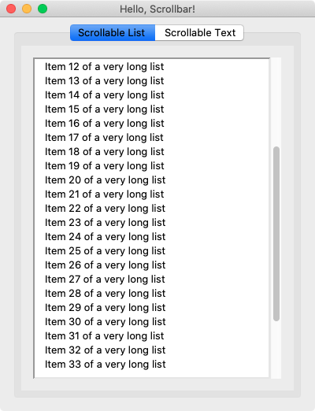

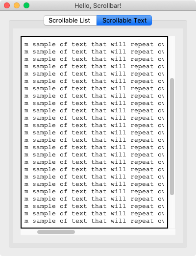

### Hello, Scrollbar Frame!

Glimmer code (from [samples/hello/hello_scrollbar_frame.rb](samples/hello/hello_scrollbar_frame.rb)):

```ruby
require 'glimmer-dsl-tk'

include Glimmer

root {
  title 'Hello, Scrollbar Frame!'
  width 400
  height 400
  
  notebook {
    grid sticky: 'nsew'
    
    frame(text: 'X/Y Scroll') {
      scrollbar_frame {
        30.times do |row|
          10.times do |column|
            button {
              grid row: row, column: column, row_weight: 0, column_weight: 0
              text "Row #{row} | Column #{column}"
            }
          end
        end
      }
    }
    
    frame(text: 'Y Scroll') {
      scrollbar_frame {
        xscrollbar false
        
        30.times do |row|
          2.times do |column|
            button {
              grid row: row, column: column, row_weight: 0, column_weight: 0
              text "Row #{row} | Column #{column}"
            }
          end
        end
      }
    }
    
    frame(text: 'X Scroll') {
      scrollbar_frame {
        yscrollbar false
        
        13.times do |row|
          10.times do |column|
            button {
              grid row: row, column: column, row_weight: 0, column_weight: 0
              text "Row #{row} | Column #{column}"
            }
          end
        end
      }
    }
  }
}.open
```

Run with [glimmer-dsl-tk](https://rubygems.org/gems/glimmer-dsl-tk) gem installed:

```
ruby -r glimmer-dsl-tk -e "require 'samples/hello/hello_scrollbar_frame'"
```

Alternatively, run from cloned project without [glimmer-dsl-tk](https://rubygems.org/gems/glimmer-dsl-tk) gem installed:

```
ruby -r ./lib/glimmer-dsl-tk.rb samples/hello/hello_scrollbar_frame.rb
```

Glimmer app:

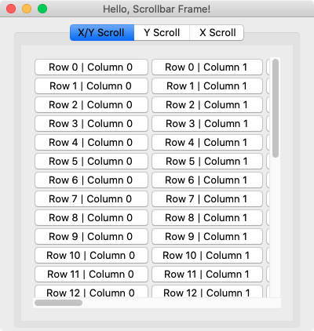

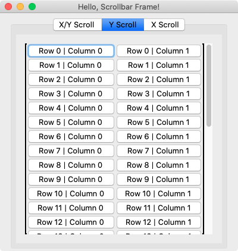

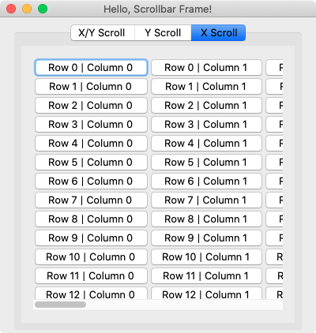

### Hello, Menu Bar!

Glimmer code (from [samples/hello/hello_menu_bar.rb](samples/hello/hello_menu_bar.rb)):

```ruby
require 'glimmer-dsl-tk'

include Glimmer

COLORS = [:white, :red, :yellow, :green, :blue, :magenta, :gray, :black]

Tk::Tile::Style.theme_use "classic" # this enables setting background on label just for demo purposes

root { |r|
  title 'Hello, Menu Bar!'
  
  @label = label {
    grid row_weight: 1, column_weight: 1
    text 'Check Out The Menu Bar Above!'
    font size: 50
    anchor 'center'
  }
  
  menu_bar {
    # Mac-specific application menu (right next to the Apple menu)
    if OS.mac?
      menu(:application) {
        menu_item(:about, label: 'About My Application') {
          accelerator 'Command+A'
          
          on('command') do
            message_box(parent: r, title: 'About', message: 'About my application.')
          end
        }
        
        menu_item(:preferences) {
          on('command') do
            message_box(parent: r, title: 'Preferences', message: 'Preferences of my application.')
          end
        }
        
        # If not defined, application simply quits upon selecting Quit menu item
        menu_item(:quit) {
          on('command') do
            message_box(parent: r, title: 'Quit', message: 'Quitting my application...')
            exit(0)
          end
        }
      }
    end
    
    # Windows-specific system menu (to the top-left of the window frame)
    if OS.windows?
      menu(label: 'System')
    end
    
    menu(label: 'File', underline: 0) {
      menu_item(label: 'New', underline: 0) {
        accelerator OS.mac? ? 'Command+N' : 'Control+N'

        on('command') do
          message_box(parent: r, title: 'New', message: 'New file created.')
        end
      }
      
      menu_item(label: 'Open...', underline: 0) {
        accelerator OS.mac? ? 'Command+O' : 'Control+O'

        on('command') do
          message_box(parent: r, title: 'Open', message: 'Opening File...')
        end
      }
      
      menu(label: 'Open Recent', underline: 5) {
        menu_item(label: 'File 1') {
          on('command') do
            message_box(parent: r, title: 'File 1', message: 'File 1 Contents')
          end
        }
        
        menu_item(label: 'File 2') {
          on('command') do
            message_box(parent: r, title: 'File 2', message: 'File 2 Contents')
          end
        }
      }
      
      menu_item(:separator)
      
      menu_item(label: 'Exit', underline: 1) {
        on('command') do
          exit(0)
        end
      }
    }
    
    menu(label: 'Edit', underline: 0) {
      menu_item(label: 'Cut', underline: 2) {
        accelerator OS.mac? ? 'Command+X' : 'Control+X'
      }
      
      menu_item(label: 'Copy', underline: 0) {
        accelerator OS.mac? ? 'Command+C' : 'Control+C'
      }
      
      menu_item(label: 'Paste', underline: 0) {
        accelerator OS.mac? ? 'Command+V' : 'Control+V'
      }
    }
    
    menu(label: 'Options', underline: 0) {
      menu_item(:checkbutton, label: 'Enabled', underline: 0) {
        on('command') do
          @select_one_menu.children.each { |menu_item| menu_item.state = menu_item.state == 'disabled' ? 'normal' : 'disabled' }
          @select_multiple_menu.children.each { |menu_item| menu_item.state = menu_item.state == 'disabled' ? 'normal' : 'disabled' }
        end
      }
      
      @select_one_menu = menu(label: 'Select One', underline: 7) {
        menu_item(:radiobutton, label: 'Option 1') {
          state 'disabled'
        }
        menu_item(:radiobutton, label: 'Option 2') {
          state 'disabled'
        }
        menu_item(:radiobutton, label: 'Option 3') {
          state 'disabled'
        }
      }
      
      @select_multiple_menu = menu(label: 'Select Multiple', underline: 7) {
        menu_item(:checkbutton, label: 'Option 4') {
          state 'disabled'
        }
        menu_item(:checkbutton, label: 'Option 5') {
          state 'disabled'
        }
        menu_item(:checkbutton, label: 'Option 6') {
          state 'disabled'
        }
      }
    }
    
    menu(label: 'Language', underline: 3) {
      ['denmark', 'finland', 'france', 'germany', 'italy', 'mexico', 'netherlands', 'norway', 'usa'].each do |image_name|
        menu_item(:radiobutton, label: image_name.capitalize) {
          selection image_name == 'usa'
          image File.expand_path("images/#{image_name}.png", __dir__)
          
          on('command') do
            message_box(parent: r, title: 'Language Selection', message: "You selected the language of #{image_name.capitalize}!")
          end
        }
      end
    }
    
    menu(label: 'Country', underline: 0) {
      ['denmark', 'finland', 'france', 'germany', 'italy', 'mexico', 'netherlands', 'norway', 'usa'].each do |image_name|
        menu_item(:radiobutton, label: image_name.capitalize) {
          selection image_name == 'usa'
          image File.expand_path("images/#{image_name}.png", __dir__)
          compound 'left'
          
          on('command') do
            message_box(parent: r, title: 'Country Selection', message: "You selected the country of #{image_name.capitalize}!")
          end
        }
      end
    }
    
    menu(label: 'Format', underline: 0) {
      menu(label: 'Background Color', underline: 0) {
        COLORS.each { |color_style|
          menu_item(:radiobutton, label: color_style.to_s.split('_').map(&:capitalize).join(' ')) {
            on('command') do
              @label.background = color_style
            end
          }
        }
      }
      
      menu(label: 'Foreground Color', underline: 11) {
        COLORS.each { |color_style|
          menu_item(:radiobutton, label: color_style.to_s.split('_').map(&:capitalize).join(' ')) {
            on('command') do
              @label.foreground = color_style
            end
          }
        }
      }
    }
    
    menu(label: 'View', underline: 0) {
      menu_item(:radiobutton, label: 'Small', underline: 0) {
        accelerator OS.mac? ? 'Command+S' : 'Control+S'
        
        on('command') do
          @label.font = {size: 25}
        end
      }
      
      menu_item(:radiobutton, label: 'Medium', underline: 0) {
        accelerator OS.mac? ? 'Command+M' : 'Control+M'
        selection true

        on('command') do
          @label.font = {size: 50}
        end
      }
      
      menu_item(:radiobutton, label: 'Large', underline: 0) {
        accelerator OS.mac? ? 'Command+L' : 'Control+L'
        
        on('command') do
          @label.font = {size: 75}
        end
      }
    }
    
    # Mac-specific window menu (containing zooming/resizing menu items)
    menu(label: 'Window', underline: 0) if OS.mac?
    
    menu(label: 'Help', underline: 0) {
      if OS.mac?
        menu_item(:help) {
          on('command') do
            message_box(parent: r, title: 'Help', message: 'Help for my application.')
          end
        }
      end
      
      menu_item(label: 'Manual', underline: 0) {
        accelerator OS.mac? ? 'Command+Shift+M' : 'Control+U'

        on('command') do
          message_box(parent: r, title: 'Manual', message: 'Manual Contents')
        end
      }
      
      menu_item(label: 'Tutorial', underline: 0) {
        accelerator OS.mac? ? 'Command+Shift+T' : 'Control+T'

        on('command') do
          message_box(parent: r, title: 'Tutorial', message: 'Tutorial Contents')
        end
      }
      
      menu_item(:separator)
      
      menu_item(label: 'Report an Issue...', underline: 0) {
        on('command') do
          message_box(parent: r, title: 'Report an Issue', message: 'Reporting an issue...')
        end
      }
    }
  }
}.open
```

Run with [glimmer-dsl-tk](https://rubygems.org/gems/glimmer-dsl-tk) gem installed:

```
ruby -r glimmer-dsl-tk -e "require 'samples/hello/hello_menu_bar'"
```

Alternatively, run from cloned project without [glimmer-dsl-tk](https://rubygems.org/gems/glimmer-dsl-tk) gem installed:

```
ruby -r ./lib/glimmer-dsl-tk.rb samples/hello/hello_menu_bar.rb
```

Glimmer app:

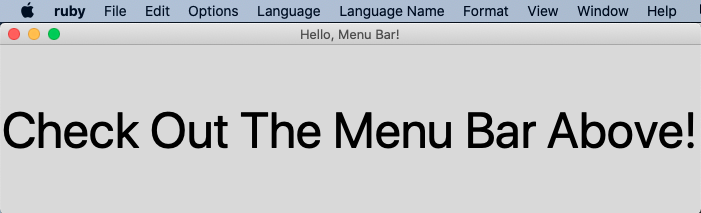

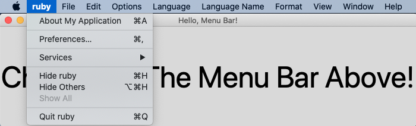

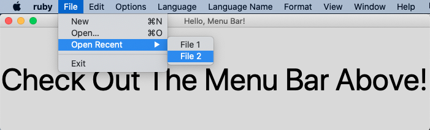

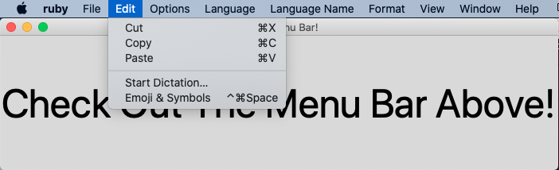

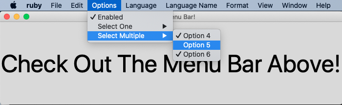

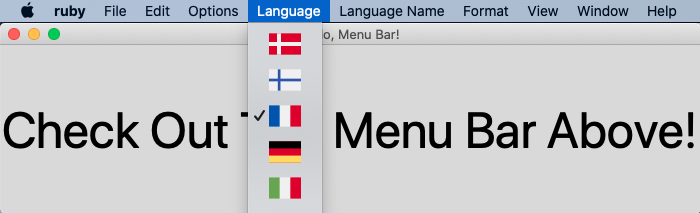

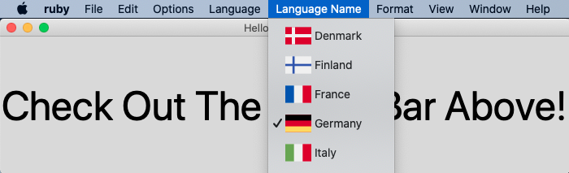

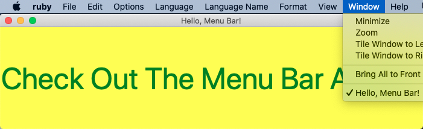


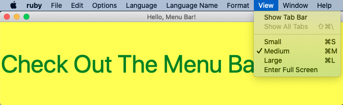

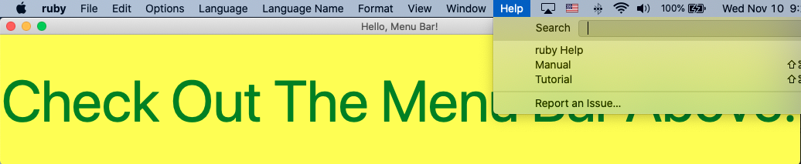

### Hello, Contextual Menu!

Glimmer code (from [samples/hello/hello_contextual_menu.rb](samples/hello/hello_contextual_menu.rb)):

```ruby
require 'glimmer-dsl-tk'

include Glimmer

COLORS = [:white, :red, :yellow, :green, :blue, :magenta, :gray, :black]

Tk::Tile::Style.theme_use 'classic' if OS.mac? # this enables setting background on label just for demo purposes

root { |r|
  title 'Hello, Contextual Menu!'
  
  @label = label {
    grid row_weight: 1, column_weight: 1
    text 'Right-Click To Pop Up Contextual Menu!'
    font size: 50
    anchor 'center'
  }
  
  # Contextual Menu is bound to mouse right-click (and CTRL-click on Mac) by default
  # (Read Comment Below for Alternative)
  menu {
    menu(label: 'Edit', underline: 0) {
      menu_item(label: 'Cut', underline: 2) {
        accelerator OS.mac? ? 'Command+X' : 'Control+X'
      }
      
      menu_item(label: 'Copy', underline: 0) {
        accelerator OS.mac? ? 'Command+C' : 'Control+C'
      }
      
      menu_item(label: 'Paste', underline: 0) {
        accelerator OS.mac? ? 'Command+V' : 'Control+V'
      }
    }
    
    menu(label: 'Options', underline: 0) {
      menu_item(:checkbutton, label: 'Enabled', underline: 0) {
        on('command') do
          @select_one_menu.children.each { |menu_item| menu_item.state = menu_item.state == 'disabled' ? 'normal' : 'disabled' }
          @select_multiple_menu.children.each { |menu_item| menu_item.state = menu_item.state == 'disabled' ? 'normal' : 'disabled' }
        end
      }
      
      @select_one_menu = menu(label: 'Select One', underline: 7) {
        menu_item(:radiobutton, label: 'Option 1') {
          state 'disabled'
        }
        menu_item(:radiobutton, label: 'Option 2') {
          state 'disabled'
        }
        menu_item(:radiobutton, label: 'Option 3') {
          state 'disabled'
        }
      }
      
      @select_multiple_menu = menu(label: 'Select Multiple', underline: 7) {
        menu_item(:checkbutton, label: 'Option 4') {
          state 'disabled'
        }
        menu_item(:checkbutton, label: 'Option 5') {
          state 'disabled'
        }
        menu_item(:checkbutton, label: 'Option 6') {
          state 'disabled'
        }
      }
    }
    
    menu(label: 'Language', underline: 3) {
      ['denmark', 'finland', 'france', 'germany', 'italy', 'mexico', 'netherlands', 'norway', 'usa'].each do |image_name|
        menu_item(:radiobutton, label: image_name.capitalize) {
          selection image_name == 'usa'
          image File.expand_path("images/#{image_name}.png", __dir__)
          
          on('command') do
            message_box(parent: r, title: 'Language Selection', message: "You selected the language of #{image_name.capitalize}!")
          end
        }
      end
    }
    
    menu(label: 'Country', underline: 0) {
      ['denmark', 'finland', 'france', 'germany', 'italy', 'mexico', 'netherlands', 'norway', 'usa'].each do |image_name|
        menu_item(:radiobutton, label: image_name.capitalize) {
          selection image_name == 'usa'
          image File.expand_path("images/#{image_name}.png", __dir__)
          compound 'left'
          
          on('command') do
            message_box(parent: r, title: 'Country Selection', message: "You selected the country of #{image_name.capitalize}!")
          end
        }
      end
    }
        
    menu(label: 'Format', underline: 3) {
      menu(label: 'Background Color', underline: 0) {
        COLORS.each { |color_style|
          menu_item(:radiobutton, label: color_style.to_s.split('_').map(&:capitalize).join(' ')) {
            on('command') do
              @label.background = color_style
            end
          }
        }
      }
      
      menu(label: 'Foreground Color', underline: 11) {
        COLORS.each { |color_style|
          menu_item(:radiobutton, label: color_style.to_s.split('_').map(&:capitalize).join(' ')) {
            on('command') do
              @label.foreground = color_style
            end
          }
        }
      }
    }
    
    menu(label: 'View', underline: 0) {
      menu_item(:radiobutton, label: 'Small', underline: 0) {
        accelerator 'Control+S'
        
        on('command') do
          @label.font = {size: 25}
        end
      }
      
      menu_item(:radiobutton, label: 'Medium', underline: 0) {
        accelerator 'Control+M'
        selection true

        on('command') do
          @label.font = {size: 50}
        end
      }
      
      menu_item(:radiobutton, label: 'Large', underline: 0) {
        accelerator 'Control+L'
        
        on('command') do
          @label.font = {size: 75}
        end
      }
    }
  }
  
  # You can replace `menu {` code with `menu(bind: false) {` if you want to bind manually,
  # which can be useful if you want to show menu at a specific location based on conditional logic.
  #
  # You can also repurpose a `menu_bar` as a contextual menu by declaring `@menu = menu_bar {` and
  # binding to mouse right-click.
  #
  # Example:
  #
  # @menu = menu(bind: false) {
  #   menu(label: 'File', underline: 0) {
  #     menu_item(label: 'Exit')
  #   }
  # }
  # if OS.mac?
  #   on('2') do |event|
  #     @menu.popup(event.x_root, event.y_root)
  #   end
  #   on('Control-1') do |event|
  #     @menu.popup(event.x_root, event.y_root)
  #   end
  # else
  #   on('3') do |event|
  #     @menu.popup(event.x_root, event.y_root)
  #   end
  # end
}.open
```

Run with [glimmer-dsl-tk](https://rubygems.org/gems/glimmer-dsl-tk) gem installed:

```
ruby -r glimmer-dsl-tk -e "require 'samples/hello/hello_contextual_menu'"
```

Alternatively, run from cloned project without [glimmer-dsl-tk](https://rubygems.org/gems/glimmer-dsl-tk) gem installed:

```
ruby -r ./lib/glimmer-dsl-tk.rb samples/hello/hello_contextual_menu.rb
```

Glimmer app:

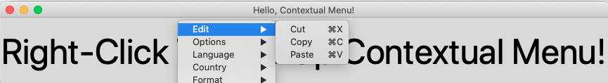

## Applications

### Glimmer Tk Calculator

"I wanted to try how it feels to write an UI in glimmer-dsl-tk so I decided to write an alternative version of the [Glimmer Calculator](https://github.com/AndyObtiva/glimmer-cs-calculator) that uses [Tk]([Tk](https://www.tcl.tk/)) and runs in the regular [MRI Ruby interpreter](https://www.ruby-lang.org/en/)." - [Ancor Gonzalez Sosa](https://github.com/ancorgs)

https://github.com/ancorgs/glimmer-tk-calculator


### Y3network Ruby UI

https://github.com/ancorgs/y3network-ruby-ui

### CryptoPunks GUI

This is a Graphical User Interface for the famous [cryptopunks Ruby gem](https://github.com/cryptopunksnotdead/cryptopunks/tree/master/cryptopunks).

https://github.com/cryptopunksnotdead/cryptopunks-gui


### Circule

Generate an icon of overlapping circles derived from a hash.

[Demo Video](https://gitlab.com/fjc/circule/-/raw/master/circule-demo.mp4)

https://gitlab.com/fjc/circule

## Process

[Glimmer Process](https://github.com/AndyObtiva/glimmer/blob/master/PROCESS.md)

## Resources

- [Tk Tutorial](https://tkdocs.com/tutorial/index.html)
- [Official Tk Command Reference](https://tcl.tk/man/tcl8.6/TkCmd/contents.htm)
- [Code Master Blog](https://andymaleh.blogspot.com/search/label/Tk)

## Help

### Issues

If you encounter [issues](https://github.com/AndyObtiva/glimmer-dsl-tk/issues) that are not reported, discover missing features that are not mentioned in [TODO.md](TODO.md), or think up better ways to use [Tk](https://www.tcl.tk/) than what is possible with [Glimmer DSL for Tk](https://rubygems.org/gems/glimmer-dsl-tk), you may submit an [issue](https://github.com/AndyObtiva/glimmer-dsl-tk/issues/new) or [pull request](https://github.com/AndyObtiva/glimmer-dsl-tk/compare) on [GitHub](https://github.com).

### Chat

If you need live help, try to [](https://gitter.im/AndyObtiva/glimmer?utm_source=badge&utm_medium=badge&utm_campaign=pr-badge&utm_content=badge)

## Planned Features and Feature Suggestions

These features have been planned or suggested. You might see them in a future version of [Glimmer DSL for Tk](https://rubygems.org/gems/glimmer-dsl-tk). You are welcome to contribute more feature suggestions.

[TODO.md](TODO.md)

## Change Log

[CHANGELOG.md](CHANGELOG.md)

## Contributing

[CONTRIBUTING.md](CONTRIBUTING.md)

## Contributors

* [Andy Maleh](https://github.com/AndyObtiva) (Founder)
* [vin1antme](https://github.com/vin1antme)

[Click here to view contributor commits.](https://github.com/AndyObtiva/glimmer-dsl-tk/graphs/contributors)

## License

[MIT](LICENSE.txt)

Copyright (c) 2020-2022 - Andy Maleh.

--

[](https://github.com/AndyObtiva/glimmer) Built for [Glimmer](https://github.com/AndyObtiva/glimmer) (DSL Framework).
